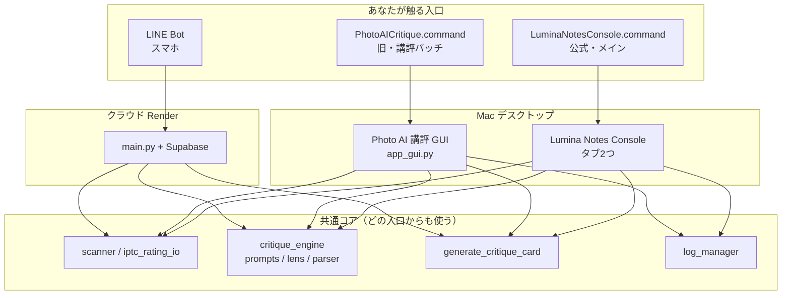
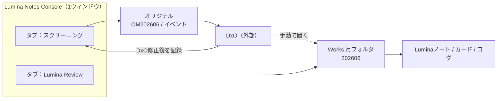
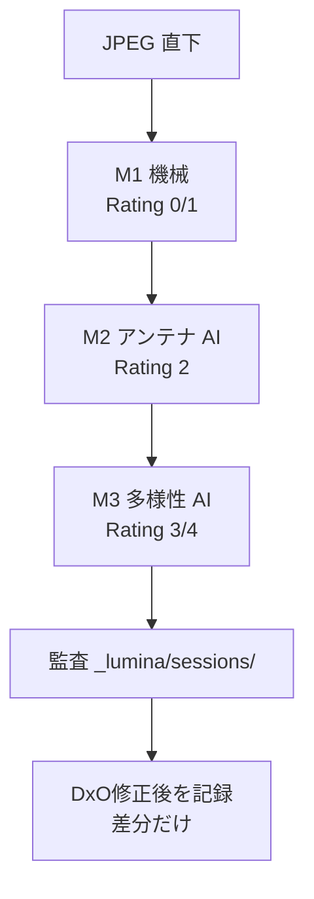
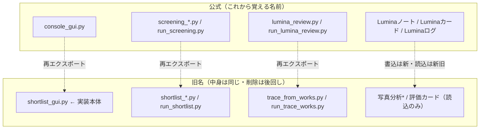
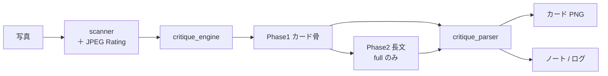

# 現在のアプリ全体マップ（CURRENT_APP_MAP）

更新日: 2026-08-12  
位置づけ: **オーナー向けの現状図解**。改修で名前が分岐→公式に寄せたあとの「いま何が本番か」を一目で見る。  
詳細仕様の正本は [`ARCHITECTURE.md`](../ARCHITECTURE.md)。運用契約は [`R1A_DESKTOP_OPS_POLICY.md`](R1A_DESKTOP_OPS_POLICY.md)。UX 計画は [`R1A_UX_IMPROVEMENT_PLAN.md`](R1A_UX_IMPROVEMENT_PLAN.md)。

---

## 0. 一文で

日常の本番は **Lumina Notes Console**（スクリーニング＋ Lumina Review の1ウィンドウ・タブ2つ）。  
AI カード／ノートの中身は、デスクトップも LINE も **同じ共通コア** を使う。旧名・旧ランチャーは互換のため残っている。

---

## 1. アプリは大きく3つ



| 入口 | 役割 | いまの位置づけ |
|------|------|----------------|
| **Lumina Notes Console** | 深い輪：選別＋対話ノート | **日常の本番** |
| **Photo AI 講評** | フォルダ一括の講評（旧UI） | 残存。将来は Console Review に寄せる候補 |
| **LINE Bot** | 1枚ずつの対話 | クラウド側 |

起動の対応:

| やりたいこと | 起動 |
|--------------|------|
| Console | `LuminaNotesConsole.command` または `python3 console_gui.py` |
| 旧講評 GUI | `PhotoAICritique.command` または `python3 app_gui.py` |
| スクリーニング CLI | `python3 run_screening.py` |
| Lumina Review CLI | `python3 run_lumina_review.py` |

---

## 2. Console の中（Wave A/B 後）



要点:

- **2つのタブは独立**（Lumina Review だけ実行してよい）
- アプリは **ファイルをコピーしない**（Works への配置は手動）
- スクリーニング既定は **月直下 JPEG のみ**。任意で「配下イベントも順に実行」
- 「DxO修正後を記録」は **単位ごと**（イベントはフォルダを切り替えて記録）

---

## 3. スクリーニングの中身（M1→M2→M3）



Rating はパイプライン状態（DxO の「出来の星」とは別）:

`0=除外 / 1=M1 / 2=M2 / 3=余白 / 4=上位`

---

## 4. 「分岐した名前」の整理

改修で **公式名に寄せ**、古い名前は **薄い互換（alias）** として残している。  
実装の実体がまだ `shortlist_*.py` にあるのは、「中身を壊さず入口だけ新名にした」ため。旧 alias 削除は後続。



| 概念 | 公式 | 旧（互換） |
|------|------|------------|
| 画面 | Lumina Notes Console | Shortlist |
| 選別 | スクリーニング | shortlist |
| Works 対話 | Lumina Review | trace / 痕跡 |
| 出力フォルダ | `{ym}Luminaノート` 等 | 写真分析* / 評価カード |
| ランチャー | `LuminaNotesConsole.command` | `LuminaShortlist.command`（スタブ） |

棚卸しの詳細: [`R1A_NAMING_CLEANUP.md`](R1A_NAMING_CLEANUP.md)

---

## 5. 共通コア（AI 対話の一本道）



- Desktop Console の Review・旧講評 GUI・LINE は、この道を共有する
- レンズ（`critique_lens`）とモード（`compact` / `full`）は直交
- カード背景テーマ（`dark` / `light`）は `card_theme.py` が単一ソース

---

## 6. フォルダの置き場（運用の地図）

```text
オリジナル（機種接頭辞）
  ~/OM2026/OM202606/                 ← スクリーニング・月
  ~/OM2026/OM202606/OM20260615_旅行/ ← スクリーニング・イベント

Works（ユーザー作成・月のみ）
  ~/2026/202606/                     ← Lumina Review 対象
    *_dev.jpg 優先（なければ撮って出し）
    202606Luminaノート/
    202606Luminaカード/
    202606Luminaログ.txt
  ~/2026/Luminaログ_2026.txt
```

アプリは Works を自動作成・コピーしない。

---

## 7. いま覚える使い分け

1. **選ぶ・Rating を付ける** → Console「スクリーニング」  
2. **DxO で直して記録** → 同じタブの「DxO修正後を記録」  
3. **Works に置いて対話ノート** → Console「Lumina Review」  
4. **LINE** → 別チャネル（同じ AI コア）  
5. **PhotoAICritique** → 旧一括講評（任意）

---

## 8. 関連ドキュメント

| 文書 | 内容 |
|------|------|
| [`ARCHITECTURE.md`](../ARCHITECTURE.md) | 設計仕様・開発規則 |
| [`LUMINA_NOTES_SERVICE_CONCEPT.md`](LUMINA_NOTES_SERVICE_CONCEPT.md) | サービス構想（二速度） |
| [`R1A_DESKTOP_OPS_POLICY.md`](R1A_DESKTOP_OPS_POLICY.md) | デスクトップ運用契約 |
| [`R1A_UX_IMPROVEMENT_PLAN.md`](R1A_UX_IMPROVEMENT_PLAN.md) | UX Wave A/B/C |
| [`R1A_MAC_MANUAL_CHECKLIST.md`](R1A_MAC_MANUAL_CHECKLIST.md) | Mac 手動確認 |
| [`R1A_NAMING_CLEANUP.md`](R1A_NAMING_CLEANUP.md) | 命名棚卸し |

---

## 9. 変更履歴

| 日付 | 内容 |
|------|------|
| 2026-08-12 | 初版。Wave A/B マージ後の現状を図解 |
