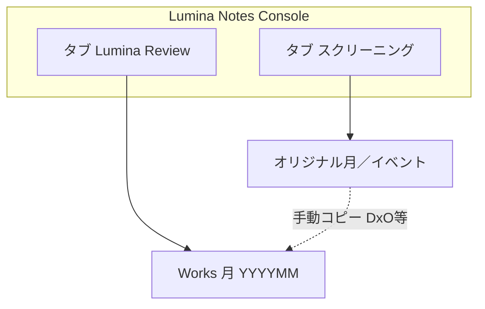
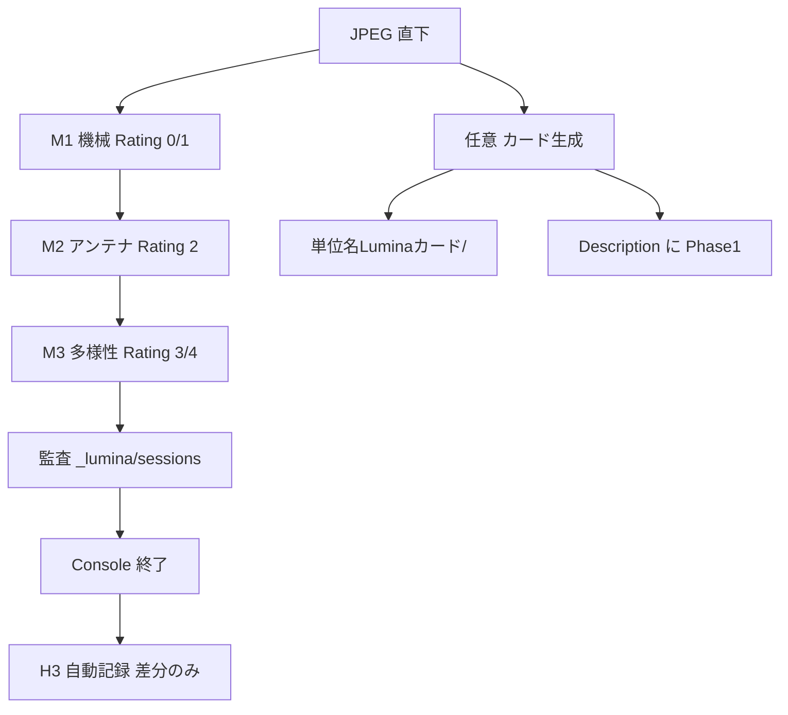
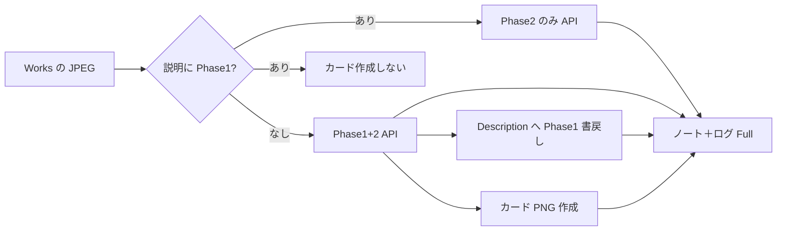
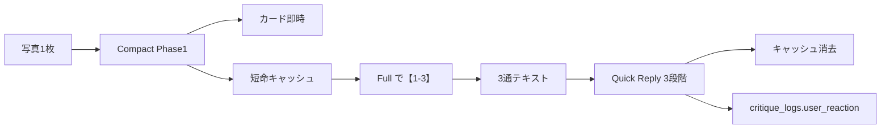
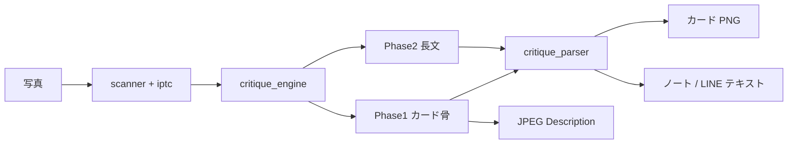

# いまのアプリ全体図（Wave A/B/C 後）

更新日: 2026-08-13  
位置づけ: 公開前βの **現在形**。詳細仕様の正本は [`ARCHITECTURE.md`](../ARCHITECTURE.md)。運用は [`R1A_DESKTOP_OPS_POLICY.md`](R1A_DESKTOP_OPS_POLICY.md)。

---

## 0. 一文で

**Lumina Notes** は「選ぶ → DxO で直す →（任意）カード → Works で深く対話」の深い輪と、**LINE でカード＋短い対話**の速い輪を、同じ AI コアでつなぐアプリです。

Wave C で決まった核:

- **カード** ＝ Phase1（TITLE / SUMMARY / SCORES / CRITIQUE_SUMMARY）
- **対話** ＝ 長文の節（Desktop は【1〜7】、LINE は【1〜3】）
- Phase1 の正本は **JPEG の説明欄（Description）**（DxO と同期）

---

## 1. 入口（何を起動するか）

| 入口 | 役割 | 状態 |
|------|------|------|
| `LuminaNotesConsole.command` | **日常の本番 UI**（スクリーニング＋Lumina Review） | 正式 |
| `PhotoAICritique.command` | 旧・一括講評 GUI（起動時に Console へ誘導） | レガシー |
| LINE Bot（Render / `main.py`） | 写真1枚 → カード＋対話【1〜3】→ 反応 QR | 本番チャネル |

Console を `.command` から起動して閉じると、Terminal ウィンドウも閉じます。  
旧 `LuminaShortlist.command` / `run_shortlist.py` / `run_trace_works.py` は削除済み（公式名のみ）。

---

## 2. Console の2タブ（独立）



- 2タブに **必須の前後関係はない**（Review だけでも可）
- アプリは Works へ **コピーしない**

---

## 3. スクリーニング（選ぶ）



| 操作 | 内容 |
|------|------|
| M1→M2→M3 | Rating / `[M2]` `[M3]` を JPEG に書く |
| 配下イベントも順に | 月選択時のみ任意（既定 OFF） |
| **カード生成** | Rating **3/4** に Compact カード＋ Description へ Phase1（上書き ON/OFF） |
| **H3** | 手動ボタンなし。**ウィンドウを閉じると自動**（dry-run は対象外） |

Rating の意味: `0=除外 / 1=M1 / 2=M2 / 3=余白 / 4=上位`（DxO の「出来の星」とは別のパイプライン状態）

---

## 4. JPEG Description の中身（Wave C の要）

同じ説明欄に、ユーザー文・Phase1・スクリーニング理由が共存します。

```text
（任意のユーザー文）
TITLE: …
SUMMARY: …
SCORES: …（1行）
CRITIQUE_SUMMARY: …
[M2] …
[M3] …
```

- DxO に同期 → DxO だけで一覧できる
- Works へ移した JPEG に乗っている → Review が Phase1 を再生成しなくてよい
- 実装: [`iptc_rating_io.py`](../iptc_rating_io.py) + [`phase1_jpeg.py`](../phase1_jpeg.py)

---

## 5. Lumina Review（Works で深く対話）



| 成果物 | 内容 |
|--------|------|
| ノート／ログ | **従来どおり Full**: ファイル名、TITLE〜CRITIQUE_SUMMARY、**【1〜7】**、メタデータ |
| カード PNG | Phase1 が **無い** JPEG だけ作成（スクリーニング済みは省略） |
| UI | 「深さ：詳細／簡易」は **廃止**。常にカード＋詳細ノート |

出力先（公式名）: `{YYYYMM}Luminaノート/` `{YYYYMM}Luminaカード/` `{YYYYMM}Luminaログ.txt`

---

## 6. LINE（速い輪・案2）



- モード「簡易／詳細」切替は案内上 **カード＋対話に統一**
- CRITIQUE_SUMMARY のテキスト通は送らない
- Desktop の Full ログ（【1〜7】）とは **別契約**
- **N2:** 対話【1〜3】の最後に Quick Reply（👍いいね／💭もう少し／😐いまいち）→ DB `user_reaction`（good/mixed/weak）。Q5 の材料

---

## 7. 共通コア（一本道）



主なモジュール:

| 役割 | ファイル |
|------|----------|
| Console UI | `console_gui.py` → 実体 `shortlist_gui.py` |
| スクリーニング | `screening_*.py` / `shortlist_*.py`（alias） |
| スクリーニングカード | `screening_cards.py` |
| Works Review | `lumina_review.py` |
| Phase1↔JPEG | `phase1_jpeg.py` / `iptc_rating_io.py` |
| 講評生成 | `critique_engine.py`（`phase1_override` 可） |
| LINE | `main.py` / `line_messaging.py` / `line_reactions.py` |

---

## 8. フォルダの置き場

```text
オリジナル（機種接頭辞）
  ~/OM2026/OM202606/                 ← スクリーニング・月
  ~/OM2026/OM202606/OM20260615_旅行/ ← スクリーニング・イベント
    {単位名}Luminaカード/            ← スクリーニング「カード」出力

Works（ユーザー作成・月のみ）
  ~/2026/202606/                     ← Lumina Review
    *_dev.jpg 優先
    202606Luminaノート/
    202606Luminaカード/              ← Phase1 無し JPEG のみ新規
    202606Luminaログ.txt
```

---

## 9. いま覚える使い分け

1. **選ぶ** → Console「スクリーニング」
2. **DxO で Rating を直す** → 閉じれば差分は自動記録（作業不要）
3. **（任意）カード** → 同じタブの「カード生成」（Rating 3/4）
4. **Works に置いて深く対話** → Console「Lumina Review」
5. **LINE** → カード＋【1〜3】＋反応ボタン（別チャネル・同じコア）
6. **PhotoAICritique** → 旧一括講評（普段は使わない・起動時に案内）

---

## 10. Wave 後の状態（ざっくり）

| Wave | 結果 |
|------|------|
| A | API 事前確認、タブ分離、語彙・見える化 |
| B | 薄い流れ案内、イベント順実行オプション、Review 後 Finder |
| C | H3 自動、JPEG Phase1 正、スクリーニングカード、LINE 統合、Review カード省略 |
| P1+N2 | Works ガイド／失敗の次の一手／フォルダエラー親切化／役割案内／薄い alias 削除／LINE 反応 QR＋DB |
| P2-1 | 審判語契約・Phase D fixture・H3/反応集計（[`P2_1_PROMPT_IMPROVEMENT_LOOP.md`](P2_1_PROMPT_IMPROVEMENT_LOOP.md)） |

**まだやらない／やり残しの一覧:** [`R1A_REMAINING_TODO.md`](R1A_REMAINING_TODO.md)。

**次の代表例:** P2-2（N1 洗練 UI・カード見た目・Q4 等）。
