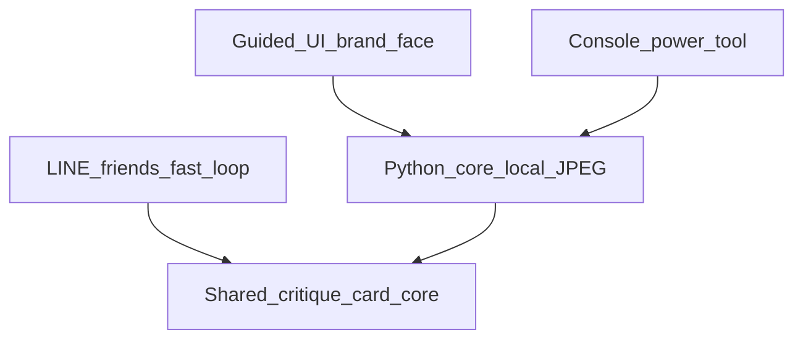

# P2-2 公開向け UX 憲章

更新日: 2026-08-13  
位置づけ: 公開βに向けた **体験・言葉・表面・シェル** の合意正本。実装詳細は後続 Phase。  
ブランド正本: [`brand/LuminaNotes_BrandBook_02.pdf`](brand/LuminaNotes_BrandBook_02.pdf)（左文は当面固定。挿絵・背景色は更新ありうる）  
関連: [`LUMINA_NOTES_SERVICE_CONCEPT.md`](LUMINA_NOTES_SERVICE_CONCEPT.md) / [`R1A_REMAINING_TODO.md`](R1A_REMAINING_TODO.md) / [`CURRENT_APP_MAP.md`](CURRENT_APP_MAP.md)

---

## 0. 合意ステータス（2026-08-13・オーナー）

| # | 項目 | 合意内容 |
|---|------|----------|
| 1 | 公開βの相手 | **Desktop**＝オーナー自身の深い輪／**LINE**＝身近な友達 |
| 2 | 製品の一文 | 下記 §1 |
| ブランド | 憲章の基準 | ブランドブック 02（左文） |
| 3 | 表面の役割 | Guided＝ブランドの顔／Console＝パワーツール／LINE＝速い輪 |
| 4 | シェル | **ローカル Web**（クラウド Web でライブラリは扱わない） |
| 5 | 進め方 | 憲章・言葉 → カード → 画面設計 → スパイク → MVP |

実装は本憲章の合意後に進める。

---

## 1. 製品の一文

> **残す、見返す、言葉にする、もう一度見る。**  
> **何が正しい写真かは、決めない。**

タグライン（ブランドブック）: **Illuminate the Sense Within.**  
場所の定義: **写真と人が、何度でも行き来できる場所。**

Lumina Notes は採点・整理ツールではない。写真との往復のなかで気づき（AWARENESS）が立ち上がる伴走である。

---

## 2. ブランドブックから固定する芯

出典ページはブック内の章番号。

### 2.1 対話の輪（06 THE DIALOGUE）

```text
残す（Photograph）
  → 見返す（Look again）
  → 言葉にする（Put into words）
  → もう一度見る（See anew）
```

そのたびに見え方が少し変わり、次の一枚へつながる。UI・コピー・カードは、この往復を邪魔しないこと。

### 2.2 思想（07 THE BELIEF）

| 向かない | 向かう |
|----------|--------|
| ノウハウ | 意味 |
| 評価 | 理解 |
| 答え | 対話 |

**何が正しい写真かは、決めない。**

### 2.3 形（08 THE FORM）

| 要素 | 意味 |
|------|------|
| Navy | 深さ |
| Ivory | 余白 |
| Gold | 残った光 |
| Typography | 必要なときだけ現れる |
| UI | **導きすぎない** |

挿絵写真・背景の具体トーンは後更新してよい。トークン名（Navy / Ivory / Gold）と「導きすぎない」は維持する。

### 2.4 Compass（09）— 迷ったときの向き

1. **Meaning** — 意味があるか  
2. **Relevance** — 本当に必要なものか  
3. **Simplicity** — 余計なものがないか  
4. **Continuity** — これからも続いていくか  

正解ルールではなく方向確認用。

### 2.5 原則（10）

1. 情報を足す前に、まず余白をつくる。  
2. 曖昧さに意味があるなら、それを残す。  
3. **まず、写真に語らせる。**

---

## 3. 公開βの表面役割



| 表面 | 誰のため | 役割 | 今の姿 |
|------|----------|------|--------|
| **Guided UI（N1）** | オーナー（深い輪のブランド体験） | 「行き来できる場所」の顔。短い招待と最小導線 | 未実装（本 P2-2 で設計→スパイク→MVP） |
| **Console** | オーナー（詳細操作） | ログ・段指定・ドライラン等のパワーツール。当面残す | `LuminaNotesConsole.command` |
| **LINE** | 身近な友達 | 速い輪: カード＋対話【1〜3】＋反応 | Render 上の Bot（既存） |

- 強制ウィザードは作らない（ブランド「UI は導きすぎない」＋既存方針）。  
- Console の即時廃止はしない。安定後に薄くする／統合する。  
- 旧 Photo AI 講評はレガシー案内のまま。

---

## 4. シェル技術（合意）

**採用: ローカル・ハイブリッド（Python コア + ブラウザ UI）**

- Mac 上で既存コア（スクリーニング／IPTC／Works Review）を呼ぶ。  
- `.command` 起動でローカルサーバ＋ブラウザを開く想定。  
- **不採用:** クラウド Web だけでライブラリを正本にする案（DxO・JPEG 正本・Works 契約と衝突）。  
- **次段候補:** スパイク不合格時は Tauri + ローカル Python。  
- **N1 本体にはしない:** Tk の見た目磨きだけ（言葉の先行適用には Console を使う）。

---

## 5. UI 用語（表層）— Phase 1 の契約たたき

表に出す言葉はブランド思想に合わせる。内部キー（Rating 0–4、M1/M2/M3、SCORES 行）はデータ契約として残してよい。

| 避けたい（表層） | 寄せたい |
|------------------|----------|
| 採点・評価・スコア（主役の言い方） | 観察・熱量・対話・気づき・問い |
| 「正しい／不正解」 | 決めない／余白／もう一度見る |
| 削除・淘汰が成果 | 残す・見返す・言葉にする |
| ダッシュボード感・機能の羅列 | 余白・写真が先・必要なときだけ文字 |

| 内部／裏方 | ユーザー向け一言（案） |
|------------|------------------------|
| M2 アンテナ | この並びのなかで、いま熱を感じるコマ（相対熱量） |
| Rating 0–4 | パイプライン上の目印（DxO の出来の星ではない） |
| CRITIQUE_SUMMARY | 次の撮影へつなぐ短い言葉／問い |
| ★（カード） | 二次表示。ヒーローにしない |

詳細コピーは Phase 1（U4 / S3 / Q7）で Console にも先行反映する。

---

## 6. 成功の見た目（受け入れの目安）

1. 初画面から **Lumina Notes** とブランドブックの空気が伝わる（Navy / Ivory / Gold、余白）。  
2. カードだけで見ても ★ が主役にならず、「言葉にする → もう一度見る」が伝わる。  
3. 完了文が「処理成功」ではなく **対話痕跡／次に写真へ戻る** トーン。  
4. Guided が導きすぎず、迷ったら Compass で削れる。  
5. オーナー（Desktop）と友達（LINE）で役割が説明できる。

---

## 7. P2-2 実装順（合意済み・憲章の次）

| Phase | 内容 | ToDo ID |
|-------|------|---------|
| 0 | 本憲章（本ドキュメント） | — |
| 1 | 言葉と操作作法（U4 / S3 / Q7）を用語＋Console 先行 | **DONE** |
| 2 | カード主役化（U1 / Q1）＋ CRITIQUE_SUMMARY の問い寄せ（Q4） | **DONE** — [`P2_2_PHASE2_CARD.md`](P2_2_PHASE2_CARD.md) |
| 3 | Guided UI 情報設計（4画面・導きすぎない） | [`P2_2_WEB_APP_CONCEPT.md`](P2_2_WEB_APP_CONCEPT.md) — オーナー確認中 |
| 4 | ローカル FastAPI＋ブラウザの技術スパイク | tech-spike |
| 5 | Guided MVP＋Mac チェックリスト | guided-mvp |

各 Phase 終わりにオーナーが PASS/FAIL を一目で見られる成果物を出す。

---

## 8. やらないこと（本憲章の範囲外）

- クラウドをライブラリの正本にする  
- Works への自動コピー  
- 強制ウィザード／全体①〜⑤の強制  
- Console の即時廃止  
- デスクトップの「そう思う／違う」専用 UI  
- モデル変更そのもの（P2-1 の実 API 再評価は別タイミング）  
- HIF 方針（S8）・レンズ拡張（Q6）

---

## 9. 変更履歴

| 日付 | 内容 |
|------|------|
| 2026-08-13 | 初版。ブランドブック 02 とオーナー合意（公開β相手・一文・表面・ローカル Web・実装順）を固定 |
| 2026-08-14 | Phase 2 完了（カード読み順・Q4 2拍）。詳細は [`P2_2_PHASE2_CARD.md`](P2_2_PHASE2_CARD.md) |
