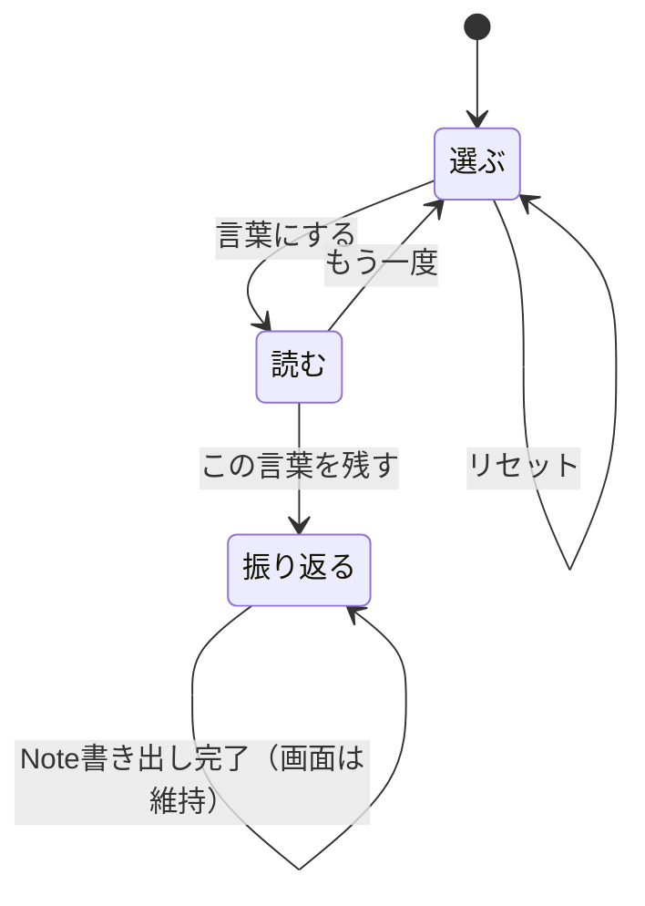
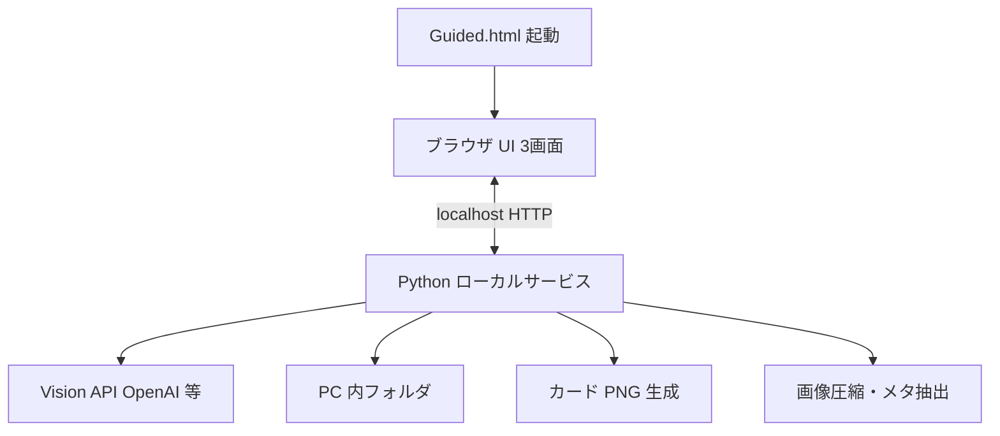

# P2-2 Phase 3 — Guided Web アプリ構想（N1）

更新日: 2026-08-28（構想 PASS・API パラメータ確定）  
位置づけ: **合意正本**。構想 PASS 済み — スパイク実装進行中。  
根拠: 合意ベースライン（§1）／オーナー添付 [`アプリ構想---.pdf`](../uploads/______---_1af2.pdf)／今回の検討条件  
関連: [`P2_2_PUBLIC_UX_CHARTER.md`](P2_2_PUBLIC_UX_CHARTER.md) / [`CURRENT_APP_MAP.md`](CURRENT_APP_MAP.md) / [`P2_2_PHASE2_CARD.md`](P2_2_PHASE2_CARD.md)

---

## 0. ステータス

| 項目 | 状態 |
|------|------|
| 合意ベースライン 1〜8（§1） | ✅ 確定 |
| 本構想（画面・技術・速度・プライバシー等） | ✅ **構想 PASS**（2026-08-28） |
| レスポンシブ（PC／タブレット／携帯） | ✅ 確定（§5.2） |
| API 抽象パラメータ仕様 | ✅ 確定（§7.3） |
| 実装 | 🔄 スパイク進行中（`guided_web/`） |
| レビュー ToDo | [`P2_2_GUIDED_WEB_REVIEW_TODO.md`](P2_2_GUIDED_WEB_REVIEW_TODO.md)（UI/UX・技術 T1–T14・プライバシー P1–P10） |
| 新チャット引き継ぎ | [`P2_2_GUIDED_WEB_HANDOFF_PROMPT.md`](P2_2_GUIDED_WEB_HANDOFF_PROMPT.md) |

---

## 1. 確定済み合意（変更しない）

| # | 内容 |
|---|------|
| 1 | 三つの役割 — Console／LINE／Web（Guided） |
| 2 | 構想を先に。PASS 後に実装 |
| 3 | 写真1枚（D&D） |
| 4 | 気に入った応答を Mac ローカルにストック |
| 5 | PC 内保存。クラウドをライブラリ正本にしない |
| 6 | `.app` で起動（保険は `LuminaNotesGuided.command`）。3画面は既存 UI |
| 7 | Console と同じ情報量。UI で段階開示（切り捨てない） |
| 8 | 採点アプリにしない。Score・【1〜7】の中身見直しは別タスク |

---

## 2. 目的（一文）

> **写真を1枚アップロードすると、写真との対話が自然に立ち上がる言葉を返す。ブラウザで読み、気に入った言葉をカードと Note として PC 内に残す。**

- 採点・正解判定ではない。  
- Console（一括・深い輪）と LINE（友達・速い輪）の**あいだ**の日常1枚用。

---

## 3. 画面構成（3画面）

添付 PDF は UI 要素が4スライドに分かれているが、**画面名は3つ**にまとめる（以前のオーナー合意と PDF の内容を統合）。

| 画面 | PDF 相当 | 役割 |
|------|----------|------|
| **選ぶ** | スライド1〜2 | 写真受け取り・一言・スタイル・送信準備 |
| **読む** | スライド3 | 応答を読む・詳細を開く |
| **振り返る** | スライド4 | カード調整・Note 書き出し |

### 画面遷移（正本）



PDF スライド3の「この言葉を残す → 読む」は**誤記とみなし、振り返るへ遷移**する。  
当初案の「Note書き出し完了 → 選ぶ」は、オーナー判断で **振り返るに留める**（トーストのみ）。

---

### 3.1 選ぶ

| UI | 動作 |
|----|------|
| 写真エリア | D&D または「写真を選ぶ」 |
| 一言添えるなら（任意） | ユーザー意図 |
| **スタイルを選択** | 対話レンズ（`lens`）— §8 |
| 圧縮画像プレビュー | **デスクトップ側**で処理後に表示 |
| 抽出パラメータ表示 | 抽象化済みの要約（GPS 等は出さない） |
| **言葉にする** | デスクトップが API 送信開始 → **読む**へ |
| **リセット** | セッション破棄 → 選ぶを初期化 |

**デスクトップ（Python）が行うこと（ブラウザはしない）:**

1. 画像読み込み・EXIF 補正・圧縮（`ai_vision.prepare_vision_image_bytes`）  
2. メタ抽出（`scanner.extract_file_metadata`）— ローカルログ用は全文保持  
3. API 用パラメータの抽象化（§7）  
4. プレビュー用 URL をブラウザへ返す  

---

### 3.2 読む

| 表示 | 開示 |
|------|------|
| 待ちアニメーション | 言葉にする直後から（スケルトン UI） |
| TITLE / SUMMARY / CRITIQUE_SUMMARY | 常時（Phase1 到着で先に表示） |
| `<Score>` プルダウン | 折りたたみ（表層は採点語を避ける） |
| `<情景描写>` プルダウン | 折りたたみ（【2】相当） |
| 【1】【3】【4】【5】【6】【7】 | Accordion（Console Full と同内容） |
| **この言葉を残す** | → **振り返る** |
| **もう一度** | → **選ぶ** |

LINE は【1〜3】のみ。**Web は Console と同じ Full 本文**を保持し、見せ方だけ薄くする（合意 #7）。

---

### 3.3 振り返る

| UI | 動作 |
|----|------|
| カードプレビュー | **デスクトップ**が `generate_critique_card` で生成 |
| 一言表示 | 選ぶで入力があれば反映 |
| この写真に対する思い ★ | **必須**。1〜5。**初期表示 ☆☆☆☆☆**（未選択）。書き出し前に選択必須 |
| カードの色 | `card_theme` プリセット |
| 一言（再編集・任意） | 書き出し前の微修正 |
| その他選択肢 | MVP 以降で拡張可 |
| **保存先** | **ユーザーがフォルダを任意選択**（§10） |
| **Noteに書き出す** | 選択先へストック（画面は**振り返る**のまま。★未選択時は押せない） |

---

## 4. 技術構成 — ブラウザ UI ＋ デスクトップ処理

今回の検討条件を反映した**役割分担**:



| 層 | 担当 | 内容 |
|----|------|------|
| **ブラウザ** | 見せる・触る | 3画面、D&D、入力、プルダウン。**PC／タブレット／携帯の画面幅に対応**（§5.2） |
| **デスクトップ（Python）** | 重い処理 | 画像処理、メタ抽出・抽象化、API 呼び出し、パース、**カード生成**、ログ・Note 書き出し |
| **PC 内保存** | 正本 | HTML/JS/CSS、Python コア、ストック出力 |

### 5.1 起動方式（確定）

アプリ一式は **PC 内の1フォルダ**に置く（例: `~/photo-critique-bot/`）。`LuminaNotesGuided.app` を **アプリケーションフォルダへコピーしない**（中のプログラムを探すため）。

**起動手順（Mac）:** [`P2_2_GUIDED_MAC_CHECKLIST.md`](P2_2_GUIDED_MAC_CHECKLIST.md) — 全操作コピペ一発・PASS/FAIL 付き

日常は **`LuminaNotesGuided.app`**（Finder から開く。ターミナルは出さない）。画面は `.command` と同じく `python3` が `127.0.0.1` で待ち、`/usr/bin/open` で開く。自前の WebView / pywebview / JXA applet は使わない。**シェル `.app` は Dock に出ない**。終了は画面右上の **「終了」**。タブを閉じる／ブラウザを終了しても、画面が無ければサーバは止まる。Finder の `.app` プロセスはサーバを待たない（待ると再起動が跳ね続ける）。

| ファイル | 役割 |
|----------|------|
| **`LuminaNotesGuided.app`** | Finder 用の入口。中身は `scripts/run_guided_app.sh`。Dock には出ない |
| **`scripts/run_guided_app.sh`** | 依存確認・サーバ起動・画面を開く（**.app 用本体**） |
| **`scripts/run_guided_web.sh`** | 同じサーバをターミナル前面で起動（保険） |
| **`LuminaNotesGuided.command`** | 保険のダブルクリック起動 |
| **`Guided.html`** | ブラウザ入口の案内 |

**起動の流れ（確定）:**

1. ユーザーが **`photo-critique-bot` フォルダ内の `LuminaNotesGuided.app`** を開く  
2. Python が `127.0.0.1` で待ち受け  
3. 選ぶ画面が開く（既定のブラウザ）。画面の「終了」、またはタブ／ブラウザを閉じるとサーバも止まる  

演算中（言葉にする・カード・書き出し）だけ `caffeinate -i`。選ぶで待っているときは Mac は眠ってよい。  
画像処理・API・カード生成は Python 必須。**他人の Mac へ Python なしで配る箱は今回やらない。**

### 5.2 レスポンシブ UI（PC／タブレット／携帯）

**追加要求（確定）:** ブラウザベースで **PC・タブレット・携帯の画面サイズ**に対応する。

| 幅の目安 | デバイス | レイアウト方針 |
|----------|----------|----------------|
| &lt; 768px | 携帯（縦） | 1カラム。写真・言葉・操作を縦積み。タップ領域 ≥ 44px |
| 768px〜1024px | タブレット | 1〜2カラム。カードプレビューは中央寄せ |
| &gt; 1024px | PC | 余白多め（Ivory）。写真と言葉を横並び可 |

**実装方針:**

- CSS **モバイルファースト** + `viewport` メタ  
- ブレークポイントは上表を基準（スパイクで微調整可）  
- 写真入力: D&D に加え **「写真を選ぶ」**（携帯はファイルピッカー必須）  
- プルダウン／Accordion はタッチで開閉しやすく  
- カードプレビューは画面幅に合わせてスケール（縦横比維持）  
- ブランドトークン（Navy / Ivory / Gold）は全幅で共通  

**アクセスの想定:**

| 使い方 | 説明 |
|--------|------|
| **主** | 同じ PC のブラウザで起動（ウィンドウ幅を変えて確認） |
| **副** | 同一 Wi-Fi 上のタブレット／携帯から `http://<PCのIP>:ポート` で開く（MVP では同一 LAN のみ。Python はホスト PC で動く） |

携帯単体で Python を動かす想定はしない（処理はホスト PC に集約）。

---

## 6. 体感速度

| 施策 | 内容 |
|------|------|
| **即遷移** | 言葉にする → 0.2s 以内に読む画面（API 完了を待たない） |
| **Phase1 先行** | 既存2段階生成の Phase1（TITLE/SUMMARY/CRITIQUE_SUMMARY）を先に表示 |
| **Phase2 後追い** | 【1〜7】はバックグラウンド → Accordion を順次埋める |
| **ローカル先行** | 選ぶ画面で圧縮プレビュー・パラメータは API 前に表示済み |
| **デスクトップ処理** | 圧縮・カード生成をブラウザでやらず Python に集約（UI が軽い） |
| **将来** | API ストリーミングで Phase2 追記表示 |

成功目安: 言葉にする → 読む **&lt; 500ms**、Phase1 が「すぐ始まった」と感じられること。

---

## 7. プライバシー設計（二重経路）

**原則:** ユーザーログ（PC 内）には**詳細**、API には**抽象化・最小化**。

### 7.1 ローカル（詳細ログ）

| 保存先 | 内容 |
|--------|------|
| セッションログ | 元ファイル名、EXIF 全文、ユーザー一言、lens、API 応答全文、タイムスタンプ |
| ストック | `note.md` / `card.png` / `session.json` |
| 監査 | 送信ハッシュ、モデル名（API キー・生 GPS は含めない） |

### 7.2 API 送信（最小化）

PDF 注記「EXIF 削除して抽出パラメータのみ」を、Vision API の実情に合わせて明確化:

| 送る | 送らない |
|------|----------|
| **EXIF 除去済み圧縮 JPEG** | オリジナルファイル、GPS、シリアル番号 |
| **抽象化パラメータ**（日時・絞り・ISO・焦点帯・時間帯ラベル等） | ローカルパス・ファイル名 |
| ユーザー一言（任意） | 個人特定可能な生メタの羅列 |
| プロンプト（lens 込み） | |

講評には画素が必要なため**画像は送る**。ただし **画像内 EXIF は除去**し、位置・機体固有 ID は載せない。

### 7.3 API 抽象パラメータ（確定 2026-08-28）

実装: [`guided_metadata.py`](../guided_metadata.py) / 時間帯: [`guided_futei_time.py`](../guided_futei_time.py)

**画像情報**

| キー | 内容 |
|------|------|
| `image_id` | セッション／コンテンツハッシュ（画像バイトから生成） |
| `size` | `幅x高さ`（例 `4032x3024`） |
| `shot_at` | 撮影時刻（ISO 8601、`DateTimeOriginal` 系） |
| `timezone` | IANA タイムゾーン（例 `Asia/Tokyo`）またはオフセット由来 |
| `region` | **都市レベル**（GPS→逆ジオコード or EXIF City。**GPS 無し時は timezone から代表都市を推定**。生 GPS は API に送らない） |
| `time_band` | 不定時法インスパイアの時間帯（下表。**GPS 無し時は timezone の代表座標で日出・日没を算出**） |

**カメラ設定**

| キー | 内容 |
|------|------|
| `focal_length` | 焦点距離 |
| `aperture` | 絞り（f 値） |
| `shutter_speed` | SS |
| `iso` | ISO 感度 |
| `mode` | 露出モード（`ExposureProgram` 等を表層ラベル化） |
| `exposure_compensation` | 露出補正（EV） |

**時間帯（`time_band`）— 不定時法準拠**

1. GPS + 撮影日時から **日出・日没**を天文計算（**GPS 無し時は `timezone` の代表座標を使用**）  
2. **明け六つ** ≈ 日出 30 分前、**暮れ六つ** ≈ 日没 30 分後を境界  
3. 昼間（明け六つ〜暮れ六つ）を **7 等分**し、次のラベルを付与  
4. それ以外（夜間帯）は **`夜`** に一括（暮れ五・四、暁九・八・七を含む）

| ラベル | 意味（光の手掛かり） |
|--------|----------------------|
| 夜明け（六） | 明け六つ付近 |
| 朝方（五） | 朝の五つ時相当 |
| 午前（四） | 午前の四つ時相当 |
| 正午（九） | 昼九つ（日中の中心付近） |
| 午後（八） | 午後の八つ時相当 |
| 夕方（七） | 夕の七つ時相当 |
| 夕暮れ（六） | 暮れ六つ付近 |
| 夜 | 上記以外の夜間 |

> 講評プロンプトの**出力**では従来どおり時間帯ラベル禁止（規則5）。`time_band` は **API 入力の事実ヒント**としてのみ使う。

---

## 8. 分析タイプ（レンズ / スタイル）

- UI 表記: **スタイルを選択**  
- 実装キー: **`lens`**（`critique_lens.py`。`mode` と直交）

| lens | 表層名 | MVP |
|------|--------|-----|
| `self` | 自分の写真と対話 | ✅ |
| `audience` | 見る人の目線 | 将来 |

選択値はセッションと Note に記録。

---

## 9. 日本語応答品質

| 方針 | 内容 |
|------|------|
| **現行** | `gpt-4o-mini` + P2-1 プロンプト改善ループ継続 |
| **Web MVP** | モデル切替はスコープ外（憲章・過去合意） |
| **品質確認** | 固定写真セットで Mac 上の読み味チェック（構想 PASS 後） |
| **将来** | 日本語特化モデルの A/B は別判断（API キー・コスト・プライバシー審査後） |

---

## 10. ストック（振り返る → Note）

### 10.1 保存先（確定: ユーザー任意選択）

- **Noteに書き出す** 時に、ユーザーが **保存フォルダを選択**する（ネイティブのフォルダ選択ダイアログ。Python 側で実装）。  
- **前回使ったパス**はローカル設定に記憶し、次回の初期値にする。  
- 初回のみ、案内として `~/Pictures/LuminaNotes/Guided/` を提案してもよい（固定ではない）。

### 10.2 1件あたりの出力

ユーザーが選んだフォルダ配下に、例えば次の構造で保存:

```text
{ユーザー選択フォルダ}/
  YYYYMM/
    YYYYMMDD_HHMMSS_{stem}/
      photo.jpg       # 圧縮コピー（EXIF 除去）
      card.png
      note.md         # DesktopLogManager 互換を目指す
      session.json    # lens, user_stars(1-5), テーマ色 等
```

`session.json` の `user_stars` は **必須**（1〜5）。未選択のまま書き出し不可。

---

## 11. 既存コアの再利用

| 処理 | モジュール | 実行場所 |
|------|------------|----------|
| メタ抽出 | `scanner.py` | Python |
| 画像圧縮 | `ai_vision.prepare_vision_image_bytes` | Python |
| 講評生成 | `critique_engine.py` | Python |
| パース | `critique_parser.py` | Python |
| カード | `generate_critique_card.py` | Python |
| テーマ色 | `card_theme.py` | Python |
| Note 形式 | `log_manager.DesktopLogManager` | Python |

**新規（最小）:** ローカル HTTP API（FastAPI 等）、`guided_privacy.py`、レスポンシブ HTML/JS 3画面、`Guided.html`、`LuminaNotesGuided.command`、保存先設定（ユーザー選択パス記憶）

---

## 12. MVP スコープ

### 含める

- 3画面、HTML + `.command` 同梱、Python で画像・カード・API  
- **レスポンシブ UI**（PC／タブレット／携帯幅）  
- lens=`self`、Phase1 先行 + Phase2 Full  
- プライバシー二重経路、**ユーザー選択フォルダ**へストック  
- ユーザー★ **必須**（初期 ☆☆☆☆☆）  

### 含めない

- フォルダ一括、クラウド正本、LINE 連携、`audience` レンズ  
- Score / 【1〜7】の構造変更（合意 #8・別タスク）  
- モデル本番切替  

---

## 13. オーナー回答（確定）

| # | 質問 | 回答 |
|---|------|------|
| Q1 | HTML + `.command` 同梱 | ✅ **同梱でよい** |
| Q2 | 画面名 選ぶ・読む・振り返る | ✅ **はい** |
| Q3 | この言葉を残す → 振り返る | ✅ **はい**（PDF「読む」は誤記） |
| Q4 | 保存先 | ✅ **ユーザーの任意選択** |
| Q5 | ユーザー★ | ✅ **必須**。初期値 **☆☆☆☆☆**（未選択表示。1〜5 を選んでから書き出し） |
| Q6 | API は EXIF 除去画像 + 抽象パラメータ | ✅ **はい** |

**追加要求:** ブラウザベースで **PC・タブレット・携帯**の画面サイズに対応 → §5.2

---

## 14. PASS / FAIL チェックリスト

| # | 確認項目 | 状態 |
|---|----------|------|
| 1 | 目的（1枚→対話の言葉→ストック） | 案どおり |
| 2 | 3画面（選ぶ・読む・振り返る）と遷移 | ✅ Q2/Q3 |
| 3 | ブラウザ UI + Python で画像・カード・API | 案どおり |
| 4 | HTML + `.command`・PC 内保存 | ✅ Q1 |
| 5 | Console 同量の本文・段階開示 | 案どおり |
| 6 | 体感速度（即読む・Phase1 先行） | 案どおり |
| 7 | プライバシー（ローカル詳細 / API 最小） | ✅ Q6 |
| 8 | lens 選択（MVP は self） | 案どおり |
| 9 | 日本語品質方針（4o-mini + プロンプト継続） | 案どおり |
| 10 | レスポンシブ（PC／タブレット／携帯） | ✅ 追加要求 |
| 11 | 保存先ユーザー選択・★必須 | ✅ Q4/Q5 |
| 実装は本構想 PASS 後 | ✅ スパイク着手済み |

---

## 15. 変更履歴

| 日付 | 内容 |
|------|------|
| 2026-08-28 | ベースライン 1〜8 のみ（リセット） |
| 2026-08-28 | **本版:** 検討条件・PDF・HTML 起動・デスクトップ処理分担を反映 |
| 2026-08-28 | **構想 PASS** + API パラメータ確定。`guided_metadata` / `guided_futei_time` 実装開始 |
