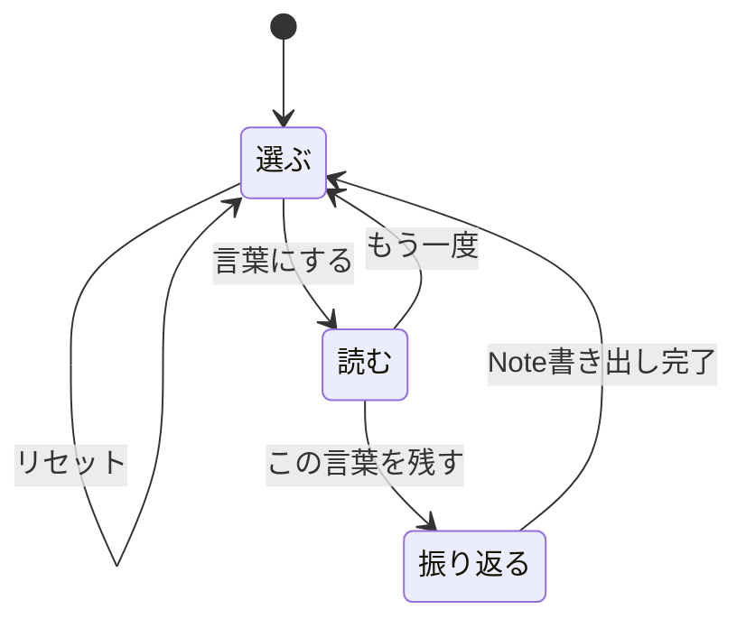
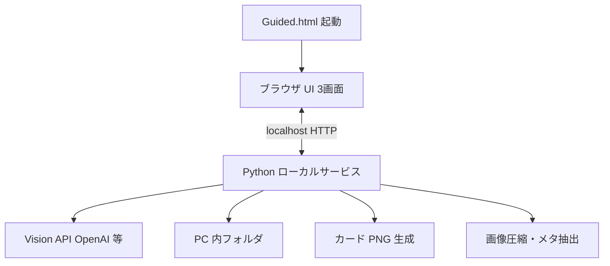

# P2-2 Phase 3 — Guided Web アプリ構想（N1）

更新日: 2026-08-28  
位置づけ: **実装前の合意正本**。オーナー PASS 後にスパイク・MVP へ進む。  
根拠: 合意ベースライン（§1）／オーナー添付 [`アプリ構想---.pdf`](../uploads/______---_1af2.pdf)／今回の検討条件  
関連: [`P2_2_PUBLIC_UX_CHARTER.md`](P2_2_PUBLIC_UX_CHARTER.md) / [`CURRENT_APP_MAP.md`](CURRENT_APP_MAP.md) / [`P2_2_PHASE2_CARD.md`](P2_2_PHASE2_CARD.md)

---

## 0. ステータス

| 項目 | 状態 |
|------|------|
| 合意ベースライン 1〜8（§1） | ✅ 確定 |
| 本構想（画面・技術・速度・プライバシー等） | ⏳ **オーナー確認待ち** |
| 実装 | ❌ 本構想 PASS 後 |

---

## 1. 確定済み合意（変更しない）

| # | 内容 |
|---|------|
| 1 | 三つの役割 — Console／LINE／Web（Guided） |
| 2 | 構想を先に。PASS 後に実装 |
| 3 | 写真1枚（D&D） |
| 4 | 気に入った応答を Mac ローカルにストック |
| 5 | PC 内保存。クラウドをライブラリ正本にしない |
| 6 | ブラウザで操作（起動は HTML — §5 で具体化） |
| 7 | Console と同じ情報量。UI で段階開示（切り捨てない） |
| 8 | 採点アプリにしない。Score・【1〜7】の中身見直しは別タスク |

---

## 2. 目的（一文）

> **写真を1枚アップロードすると、写真との対話が自然に立ち上がる言葉を返す。ブラウザで読み、気に入った言葉をカードと Note として PC 内に残す。**

- 採点・正解判定ではない。  
- Console（一括・深い輪）と LINE（友達・速い輪）の**あいだ**の日常1枚用。

---

## 3. 画面構成（3画面）

添付 PDF は UI 要素が4スライドに分かれているが、**画面名は3つ**にまとめる（以前のオーナー合意と PDF の内容を統合）。

| 画面 | PDF 相当 | 役割 |
|------|----------|------|
| **選ぶ** | スライド1〜2 | 写真受け取り・一言・スタイル・送信準備 |
| **読む** | スライド3 | 応答を読む・詳細を開く |
| **振り返る** | スライド4 | カード調整・Note 書き出し |

### 画面遷移（正本）



PDF スライド3の「この言葉を残す → 読む」は**誤記とみなし、振り返るへ遷移**する。

---

### 3.1 選ぶ

| UI | 動作 |
|----|------|
| 写真エリア | D&D または「写真を選ぶ」 |
| 一言添えるなら（任意） | ユーザー意図 |
| **スタイルを選択** | 対話レンズ（`lens`）— §8 |
| 圧縮画像プレビュー | **デスクトップ側**で処理後に表示 |
| 抽出パラメータ表示 | 抽象化済みの要約（GPS 等は出さない） |
| **言葉にする** | デスクトップが API 送信開始 → **読む**へ |
| **リセット** | セッション破棄 → 選ぶを初期化 |

**デスクトップ（Python）が行うこと（ブラウザはしない）:**

1. 画像読み込み・EXIF 補正・圧縮（`ai_vision.prepare_vision_image_bytes`）  
2. メタ抽出（`scanner.extract_file_metadata`）— ローカルログ用は全文保持  
3. API 用パラメータの抽象化（§7）  
4. プレビュー用 URL をブラウザへ返す  

---

### 3.2 読む

| 表示 | 開示 |
|------|------|
| 待ちアニメーション | 言葉にする直後から（スケルトン UI） |
| TITLE / SUMMARY / CRITIQUE_SUMMARY | 常時（Phase1 到着で先に表示） |
| `<Score>` プルダウン | 折りたたみ（表層は採点語を避ける） |
| `<情景描写>` プルダウン | 折りたたみ（【2】相当） |
| 【1】【3】【4】【5】【6】【7】 | Accordion（Console Full と同内容） |
| **この言葉を残す** | → **振り返る** |
| **もう一度** | → **選ぶ** |

LINE は【1〜3】のみ。**Web は Console と同じ Full 本文**を保持し、見せ方だけ薄くする（合意 #7）。

---

### 3.3 振り返る

| UI | 動作 |
|----|------|
| カードプレビュー | **デスクトップ**が `generate_critique_card` で生成 |
| 一言表示 | 選ぶで入力があれば反映 |
| この写真に対する思い ★ | ユーザー主観 1〜5（AI の5軸とは別・任意） |
| カードの色 | `card_theme` プリセット |
| 一言（再編集・任意） | 書き出し前の微修正 |
| その他選択肢 | MVP 以降で拡張可 |
| **Noteに書き出す** | ローカルストック → **選ぶ**へ |

---

## 4. 技術構成 — ブラウザ UI ＋ デスクトップ処理

今回の検討条件を反映した**役割分担**:



| 層 | 担当 | 内容 |
|----|------|------|
| **ブラウザ** | 見せる・触る | 3画面、D&D、テキスト入力、プルダウン、プレビュー表示 |
| **デスクトップ（Python）** | 重い処理 | 画像処理、メタ抽出・抽象化、API 呼び出し、パース、**カード生成**、ログ・Note 書き出し |
| **PC 内保存** | 正本 | HTML/JS/CSS、Python コア、ストック出力 |

### 5.1 起動方式（HTML で起動）

アプリ一式は **PC 内の1フォルダ**に置く（例: `~/Applications/LuminaNotesGuided/`）。

| ファイル | 役割 |
|----------|------|
| **`Guided.html`** | ユーザーがダブルクリックする入口 |
| `guided/` | HTML / CSS / JS（UI） |
| Python コア | 既存 `critique_engine` 等を import |

**起動の流れ（案）:**

1. ユーザーが **`Guided.html`** を開く  
2. HTML がローカル Python サービス（`127.0.0.1`）の起動を促す、または同梱ランチャーが自動起動  
3. ブラウザで UI（選ぶ画面）が表示される  

> **補足:** 画像処理・API・カード生成はブラウザだけではできないため、**必ず Python が同時に動く**。HTML は「顔」、Python は「裏方」。  
> Mac では `Guided.html` とセットで **`LuminaNotesGuided.command`**（Python 起動＋ブラウザで HTML を開く）を同梱する案が現実的（§12 質問1）。

憲章の「ローカル Web」と矛盾しない — エントリを HTML に寄せただけ。

---

## 6. 体感速度

| 施策 | 内容 |
|------|------|
| **即遷移** | 言葉にする → 0.2s 以内に読む画面（API 完了を待たない） |
| **Phase1 先行** | 既存2段階生成の Phase1（TITLE/SUMMARY/CRITIQUE_SUMMARY）を先に表示 |
| **Phase2 後追い** | 【1〜7】はバックグラウンド → Accordion を順次埋める |
| **ローカル先行** | 選ぶ画面で圧縮プレビュー・パラメータは API 前に表示済み |
| **デスクトップ処理** | 圧縮・カード生成をブラウザでやらず Python に集約（UI が軽い） |
| **将来** | API ストリーミングで Phase2 追記表示 |

成功目安: 言葉にする → 読む **&lt; 500ms**、Phase1 が「すぐ始まった」と感じられること。

---

## 7. プライバシー設計（二重経路）

**原則:** ユーザーログ（PC 内）には**詳細**、API には**抽象化・最小化**。

### 7.1 ローカル（詳細ログ）

| 保存先 | 内容 |
|--------|------|
| セッションログ | 元ファイル名、EXIF 全文、ユーザー一言、lens、API 応答全文、タイムスタンプ |
| ストック | `note.md` / `card.png` / `session.json` |
| 監査 | 送信ハッシュ、モデル名（API キー・生 GPS は含めない） |

### 7.2 API 送信（最小化）

PDF 注記「EXIF 削除して抽出パラメータのみ」を、Vision API の実情に合わせて明確化:

| 送る | 送らない |
|------|----------|
| **EXIF 除去済み圧縮 JPEG** | オリジナルファイル、GPS、シリアル番号 |
| **抽象化パラメータ**（日時・絞り・ISO・焦点帯・時間帯ラベル等） | ローカルパス・ファイル名 |
| ユーザー一言（任意） | 個人特定可能な生メタの羅列 |
| プロンプト（lens 込み） | |

講評には画素が必要なため**画像は送る**。ただし **画像内 EXIF は除去**し、位置・機体固有 ID は載せない。

---

## 8. 分析タイプ（レンズ / スタイル）

- UI 表記: **スタイルを選択**  
- 実装キー: **`lens`**（`critique_lens.py`。`mode` と直交）

| lens | 表層名 | MVP |
|------|--------|-----|
| `self` | 自分の写真と対話 | ✅ |
| `audience` | 見る人の目線 | 将来 |

選択値はセッションと Note に記録。

---

## 9. 日本語応答品質

| 方針 | 内容 |
|------|------|
| **現行** | `gpt-4o-mini` + P2-1 プロンプト改善ループ継続 |
| **Web MVP** | モデル切替はスコープ外（憲章・過去合意） |
| **品質確認** | 固定写真セットで Mac 上の読み味チェック（構想 PASS 後） |
| **将来** | 日本語特化モデルの A/B は別判断（API キー・コスト・プライバシー審査後） |

---

## 10. ストック（振り返る → Note）

**出力先（案）:**

```text
~/Pictures/LuminaNotes/Guided/
  YYYYMM/
    YYYYMMDD_HHMMSS_{stem}/
      photo.jpg       # 圧縮コピー（EXIF 除去）
      card.png
      note.md         # DesktopLogManager 互換を目指す
      session.json
```

---

## 11. 既存コアの再利用

| 処理 | モジュール | 実行場所 |
|------|------------|----------|
| メタ抽出 | `scanner.py` | Python |
| 画像圧縮 | `ai_vision.prepare_vision_image_bytes` | Python |
| 講評生成 | `critique_engine.py` | Python |
| パース | `critique_parser.py` | Python |
| カード | `generate_critique_card.py` | Python |
| テーマ色 | `card_theme.py` | Python |
| Note 形式 | `log_manager.DesktopLogManager` | Python |

**新規（最小）:** ローカル HTTP API（FastAPI 等）、`guided_privacy.py`、HTML/JS 3画面、`Guided.html`、起動用 `.command`（要否は §12）

---

## 12. MVP スコープ

### 含める

- 3画面、HTML 起動、Python で画像・カード・API  
- lens=`self`、Phase1 先行 + Phase2 Full  
- プライバシー二重経路、ローカルストック  

### 含めない

- フォルダ一括、クラウド正本、LINE 連携、`audience` レンズ  
- Score / 【1〜7】の構造変更（合意 #8・別タスク）  
- モデル本番切替  

---

## 13. 確認したいこと（質問）

| # | 質問 | 提案 |
|---|------|------|
| Q1 | **HTML だけ**で起動か、**HTML + `.command`（Python 自動起動）** 同梱か | 同梱を推奨（技術的に Python 必須） |
| Q2 | 画面名 **選ぶ・読む・振り返る** の3つでよいか | はい |
| Q3 | 「この言葉を残す」→ **振り返る** でよいか（PDF 誤記扱い） | はい |
| Q4 | ストック先 `~/Pictures/LuminaNotes/Guided/` でよいか | 上記 |
| Q5 | ユーザー★（この写真に対する思い）は任意でよいか | 任意 |
| Q6 | API は **EXIF 除去画像 + 抽象パラメータ** でよいか | はい（画像なしは不可） |

---

## 14. PASS / FAIL チェックリスト

| # | 確認項目 |
|---|----------|
| 1 | 目的（1枚→対話の言葉→ストック） |
| 2 | 3画面（選ぶ・読む・振り返る）と遷移 |
| 3 | ブラウザ UI + Python で画像・カード・API |
| 4 | HTML で起動・PC 内保存 |
| 5 | Console 同量の本文・段階開示 |
| 6 | 体感速度（即読む・Phase1 先行） |
| 7 | プライバシー（ローカル詳細 / API 最小） |
| 8 | lens 選択（MVP は self） |
| 9 | 日本語品質方針（4o-mini + プロンプト継続） |
| 10 | 実装は本構想 PASS 後 |

---

## 15. 変更履歴

| 日付 | 内容 |
|------|------|
| 2026-08-28 | ベースライン 1〜8 のみ（リセット） |
| 2026-08-28 | **本版:** 検討条件・PDF・HTML 起動・デスクトップ処理分担を反映 |
