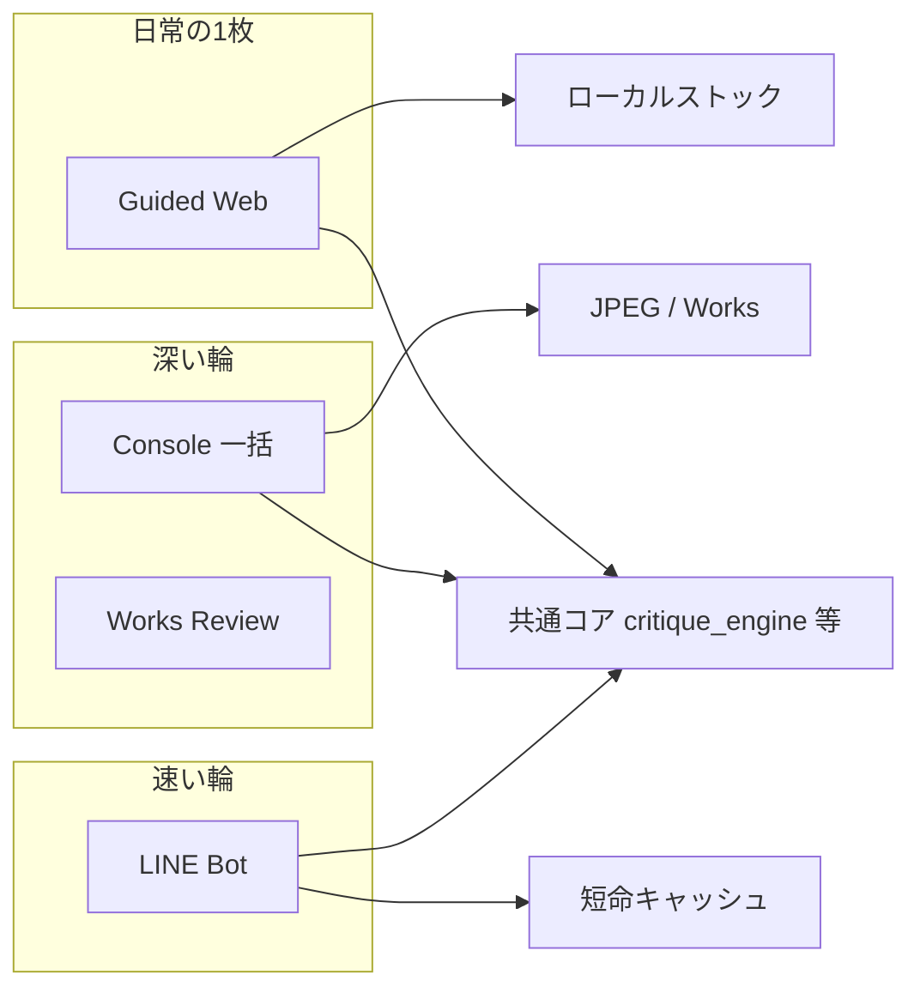
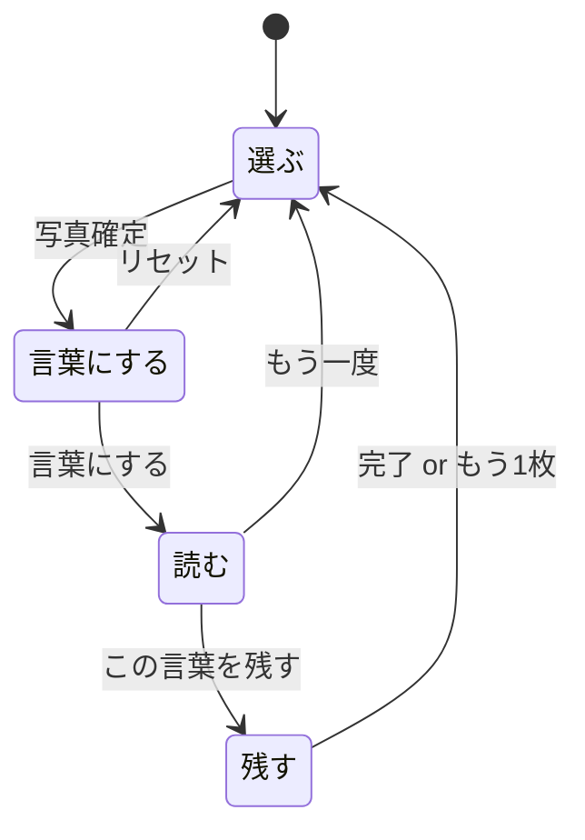

# P2-2 Phase 3 — Guided Web アプリ構想（N1）

更新日: 2026-08-28  
位置づけ: **実装前の合意正本**。オーナー PASS 後に FastAPI スパイク・MVP へ進む。  
根拠: オーナー添付 [`アプリ構想---.pdf`](../uploads/______---_5127.pdf) / Sakana 提案資料 / 既存合意（憲章・Phase 3 方向転換）  
関連: [`P2_2_PUBLIC_UX_CHARTER.md`](P2_2_PUBLIC_UX_CHARTER.md) / [`CURRENT_APP_MAP.md`](CURRENT_APP_MAP.md) / [`P2_2_PHASE2_CARD.md`](P2_2_PHASE2_CARD.md)

---

## 0. 合意ステータス

| # | 項目 | 状態 |
|---|------|------|
| 1 | 3役割（Console / LINE / Web） | ✅ 合意済み |
| 2 | 1枚ずつ・ローカル Mac・`.command` 起動 | ✅ 合意済み |
| 3 | Console と同じ情報量・UI は段階開示 | ✅ 合意済み |
| 4 | 気に入った応答をローカルにストック | ✅ 合意済み |
| 5 | 本ドキュメント（4画面・速度・プライバシー・レンズ・日本語） | ⏳ **オーナー確認待ち** |
| 6 | 実装（FastAPI / ブラウザ UI） | ❌ 本ドキュメント PASS 後 |

---

## 1. 目的（一文）

> **写真を1枚選ぶと、写真との対話が自然に立ち上がる言葉を返し、気に入った言葉をカードと Note として Mac 上に残す。**

採点アプリではない。正解を決めない。  
Console の「フォルダ一括・深い輪」と LINE の「友達・速い輪」の**あいだ**に置く、オーナー自身の**日常の往復**用サーフェス。

---

## 2. 3つの表面（再確認）

| 表面 | 誰のため | 入力 | 出力の残り方 |
|------|----------|------|----------------|
| **Console** | オーナー（パワーユーザー） | 月フォルダ・イベント一括 | JPEG Description / Works ノート / ログ |
| **LINE** | 身近な友達 | 写真1枚（チャット） | カード＋【1〜3】（短命・反応 QR） |
| **Guided Web（本構想）** | オーナー（ブランドの顔） | **写真1枚**（D&D） | **ストック**：カード PNG ＋ Note（フォトブック／展示のたね） |



---

## 3. 画面構成（4画面・添付 PDF 準拠）

添付の流れを Lumina 用語に写像する。旧 Phase 3 案の「5画面 IA」は採用しない。

### 画面一覧

| # | 画面名（表層） | 役割 | 対応する輪 |
|---|----------------|------|------------|
| 1 | **選ぶ** | 写真を1枚受け取る | Photograph |
| 2 | **言葉にする** | 任意の一言・レンズ選択・送信準備 | Put into words（準備） |
| 3 | **読む** | API 応答を読む・詳細を開く | Look again / 対話 |
| 4 | **残す** | カード調整・Note 書き出し | 残す・見返す |

### 画面遷移（確定案）



**注:** 添付 PDF スライド3では「この言葉を残す → 読む」とあるが、スライド4のカード／Note 画面と矛盾する。**本構想では「残す」画面へ遷移**とする（下記 §12 質問1）。

---

### 3.1 選ぶ

| UI | 動作 |
|----|------|
| 写真エリア | ドラッグ＆ドロップ、または「写真を選ぶ」 |
| 受け付け形式 | JPEG / PNG / HEIC（既存 `scanner` / `ai_vision` と同系） |
| やらないこと | フォルダ一括、Rating、M1〜M3 |

ローカルで即時:

1. プレビュー用サムネイル生成  
2. `scanner.extract_file_metadata` でメタ抽出（**ローカルログ用にフル保持**）  
3. 次画面へ渡す

---

### 3.2 言葉にする

| UI | 内容 |
|----|------|
| 一言添えるなら（任意） | ユーザー意図。Console の Description ユーザー文に相当 |
| **スタイルを選択** | **対話レンズ（lens）** — 下記 §7 |
| 圧縮画像プレビュー | API 送信予定の見た目をユーザーに見せる（透明性） |
| 抽出パラメータ表示 | 抽象化済みパラメータの要約（GPS・シリアル等は出さない） |
| 言葉にする | API 呼び出し開始 → **読む**へ |
| リセット | 一時ファイル破棄 → **選ぶ**へ |

**待ち時間の使い方（体感速度）:**  
送信ボタンを押した瞬間に **読む** へ遷移し、スケルトン UI ＋「いま写真を読んでいます」アニメーションを表示（§6）。

---

### 3.3 読む

| 段階 | 表示内容 | 開示 |
|------|----------|------|
| 最初に見せる | TITLE / SUMMARY / CRITIQUE_SUMMARY（カード相当の言葉） | 常時 |
| プルダウン1 | **観察の輪郭**（`<Score>` → 表層は「★の観察」等、採点語を避ける） | 開くまで折りたたみ |
| プルダウン2 | **情景描写**（Phase2 【2】相当） | 同上 |
| さらに開く（推奨） | 【1】【3】【4】【5】【6】【7】を Accordion | Console Full と同内容・段階開示 |
| この言葉を残す | **残す** へ | — |
| もう一度 | **選ぶ** へ（セッション破棄） | — |

LINE は【1〜3】のみだが、**Web は Console と同じ Full 本文を保持**し、UI だけ薄くする（合意 #7）。

---

### 3.4 残す（カード / Note）

| UI | 内容 |
|----|------|
| カードプレビュー | `generate_critique_card` 準拠（写真→言葉→★二次） |
| 一言表示 | 画面2で入力があればカード上に反映 |
| この写真に対する思い ★ | ユーザーが主観の熱量を1〜5で選ぶ（**AI の ★5軸とは別軸**・任意） |
| カードの色 | 既存 `card_theme` のプリセットから選択 |
| その他 | 将来: 余白量・ロゴ位置など（MVP は色のみで可） |
| Noteに書き出す | ローカルストックへ保存（§8） |

---

## 4. ユーザー体験の芯（憲章との接続）

| 憲章 | Web での現れ方 |
|------|----------------|
| 残す・見返す・言葉にする・もう一度見る | 4画面名そのもの |
| UI は導きすぎない | プルダウン／Accordion で詳細は任意 |
| 採点・評価を主役にしない | ★は下・小さく。最初は言葉 |
| Navy / Ivory / Gold | ローカル Web の CSS トークンで再現 |

完了メッセージ例: 「言葉を残しました。あとで見返せます。」（「処理成功」は使わない）

---

## 5. 技術シェル（ローカル・ハイブリッド）

憲章 §4 どおり。**クラウドをライブラリ正本にしない。**

```text
LuminaNotesGuided.command
  → ローカル FastAPI（127.0.0.1:固定ポート）
  → 既定ブラウザで http://127.0.0.1:.../ を開く
  → 静的 HTML/JS または軽量フレームワーク（スパイクで決定）
  → 既存 Python コアを import（critique_engine / scanner / card）
```

| 項目 | 方針 |
|------|------|
| データ正本 | Mac ローカルフォルダ（ストック用、§8） |
| 一時ファイル | セッション用 temp。リセット／完了で削除 |
| API キー | `~/.openai_api_key` 等、既存と同じ |
| オフライン | 不可（Vision API 必須）。エラー時は丁寧な次の一手 |

スパイク不合格時の代替: Tauri + ローカル Python（憲章記載）。

---

## 6. 体感速度の設計

**方針:** 実時間短縮と**知覚的短縮**の両方。ユーザーは「待たされている」と感じないことを最優先。

### 6.1 生成パイプライン（既存コア活用）

既存 `critique_engine._run_two_phase_generation` をそのまま使う:

| 段階 | 内容 | ユーザーへの見せ方 |
|------|------|-------------------|
| **Phase1** | TITLE / SUMMARY / SCORES / CRITIQUE_SUMMARY | **最優先表示**（カードの言葉が先に届く） |
| **Phase2** | 【1〜7】長文 | バックグラウンド継続 → 届き次第 Accordion を埋める |

Console / Works と同じ2段階。Web だけ「Phase1 が来た瞬間に読める」UI にする。

### 6.2 知覚的短縮（UI）

1. **即遷移** — 「言葉にする」押下 → 0.2s 以内に読む画面へ（API 完了を待たない）  
2. **スケルトン** — 写真枠・3行の言葉プレースホルダ・脈動アニメーション  
3. **段階的描画** — Phase1 到着で TITLE → SUMMARY → CRITIQUE_SUMMARY の順にフェードイン  
4. **ローカル先行** — 圧縮プレビューとパラメータ要約は API 前に表示済み  
5. **ストリーミング（Phase 2 以降）** — OpenAI / Sakana とも stream 対応。Phase2 本文を追記表示  
6. **二回目以降** — 同一セッション内の「もう一度」は temp クリアを明示

### 6.3 実時間短縮（実装）

| 施策 | 内容 |
|------|------|
| 画像 | `prepare_vision_image_bytes`（max 2048px, JPEG q85）— 既存 |
| Phase1 温度 | 0.35（既存・カード軸の安定） |
| Phase2 | Phase1 成功後のみ起動（失敗時は Phase2 を呼ばない） |
| 並列 | メタ抽出と画像圧縮は送信前に並列化可 |
| キャッシュ | 同一ファイルの再送は MVP 外（将来: ハッシュキー） |

### 6.4 成功指標（Mac チェック用）

- ボタン押下から読む画面表示: **&lt; 500ms**  
- Phase1 表示開始: ネットワーク依存だが **体感的に「すぐ言葉が始まった」**  
- Phase2 全文: バックグラウンドで揃う（待たずに読める部分から読める）

---

## 7. 分析タイプ（レンズ / スタイル）

表層ラベルは **「スタイル」** でもよいが、実装キーは既存 **`lens`** に統一する（`mode` と直交）。

| lens ID | 表層名（案） | 状態 | 説明 |
|---------|--------------|------|------|
| `self` | 自分の写真と対話 | **MVP** | 現行 `SELF_LENS`（5軸・本人伴走） |
| `audience` | 見る人の目線 | Phase 2 | 展示・フォトブック想定（`critique_lens.py` コメント参照） |

**MVP のスタイル UI:**

- ラジオまたはセグメントコントロール（1択）  
- デフォルト `self` のみ表示でも可（将来 `audience` を追加するとき UI 枠だけ用意）  
- 選択値はセッション JSON と Note メタに `lens: self` として記録

**やらないこと（本フェーズ）:**  
スタイル＝カード色・対話の長さ・モデル選択を混同しない。カード色は画面4、深さは常に Full（Console と同じ）。

---

## 8. プライバシー設計（二重経路）

**原則:** オーナーの Mac 上には**できるだけ詳しく**残し、**外部 API には必要最小限**を送る。

### 8.1 ローカル（詳細ログ・ユーザー向け透明性）

| 保存先 | 内容 |
|--------|------|
| セッションログ（`~/…/Guided/sessions/` 案） | 元ファイル名、ローカルパス（ユーザーが選んだ場合）、抽出 EXIF 全文、ユーザー一言、lens、API 応答全文、タイムスタンプ |
| ストック Note | `DesktopLogManager` 互換 Markdown（§8.3） |
| 監査用 JSON | 送信ペイロードのハッシュ、モデル名、トークン概算（キー・生 GPS は含めない） |

既存 `privacy_utils` の思想（ID マスク、パスハッシュ）を Web 用に拡張する。

### 8.2 API 送信（最小化・抽象化）

添付 PDF の注記を、Vision API の実情に合わせて明確化する:

| 送る | 送らない / 削る |
|------|------------------|
| **圧縮画像バイト**（EXIF 除去済み JPEG） | オリジナルファイルそのまま |
| **抽象化パラメータ**（下表） | GPS、シリアル、所有者名、ソフトウェアの内部 ID |
| ユーザー一言（任意） | ローカルパス・ファイル名 |
| プロンプト（lens 込み） | 個人を特定しうる生メタの羅列 |

**抽象化パラメータ（API 用 `CritiquePromptContext` 相当）:**

| 項目 | 例 | 備考 |
|------|-----|------|
| 撮影日時 | `2026-06-15 14:32` | `DateTimeOriginal` のみ |
| 時間帯ラベル | 夕方 | ルールベース |
| カメラ種別 | ミラーレス | モデル名は一般化可 |
| 焦点距離帯 | 広角 / 標準 / 望遠 | 数値から帯域へ |
| 絞り | f/2.8 | 技術文脈用 |
| シャッター | 1/125s | 同上 |
| ISO | 400 | 同上 |
| 露出補正 | -0.3 EV | あれば |

**画像について:** Vision 講評には**画素が必要**なため「画像を送らない」は採用しない。代わりに **EXIF 除去済み圧縮画像** ＋ **抽象パラメータ** で、位置情報・デバイス固有 ID の漏洩を防ぐ。

### 8.3 ストック（Note に書き出す）

**出力先（案）** — オーナー確認待ち:

```text
~/Pictures/LuminaNotes/Guided/
  YYYYMM/
    YYYYMMDD_HHMMSS_{stem}/
      photo.jpg          # 圧縮コピー（EXIF 除去）
      card.png           # 最終カード
      note.md            # Full 本文 + メタ
      session.json       # 再現用（lens, ユーザー★, テーマ色）
```

`DesktopLogManager` 形式に近い Markdown にし、将来 Console / Works と相互参照しやすくする。

---

## 9. 日本語応答品質（Sakana 提案の位置づけ）

現行本番: **`gpt-4o-mini`**（`ai_vision.DEFAULT_OPENAI_MODEL`）。  
モデル切替はオーナー判断で **当面保留**（コスト・実装コストのバランス）。

### 9.1 選択肢

| 案 | 内容 | メリット | リスク / コスト |
|----|------|----------|------------------|
| **A. 現行維持** | 4o-mini + プロンプト改善（P2-1 ループ継続） | 実装済み・最安 | 日本語の微妙な違和感が残る可能性 |
| **B. Sakana Namazu** | `base_url=https://api.sakana.ai/v1`, `sakana-namazu` | 日本語・敬語・文脈に強い。Vision 対応。OpenAI SDK 互換 | 入力 $0.95 / 出力 $4.0 per 1M（2026-08 時点・要公式確認）。4o-mini より高い。EU/UK/CH 未提供 |
| **C. ハイブリッド** | Phase1=4o-mini（構造安定）、Phase2=Namazu（読み物） | コストと品質の折衷 | 2プロバイダ保守 |
| **D. 後処理のみ** | 生成は 4o-mini → 日本語整形を Namazu テキストのみ | 画像1回 | 2段 API・遅延増 |

### 9.2 推奨（構想段階）

1. **MVP:** 案 A（4o-mini）で Web 体験・プライバシー・4画面を完成  
2. **品質ゲート:** 固定写真セットで A/B（4o-mini vs Namazu）をオフライン比較用に記録  
3. **採用判断:** Web MVP の Mac チェック後、オーナーが Namazu API キーを用意できれば B または C を Phase 3.5 として追加

`ai_vision.py` に `provider: sakana` を足すだけで試せる設計にする（実装は PASS 後）。

---

## 10. 既存コアの再利用マップ

| 機能 | モジュール | Web での使い方 |
|------|------------|----------------|
| メタ抽出 | `scanner.py` | ローカル全文 + API 用抽象化レイヤ（新規 thin wrapper） |
| 2段階講評 | `critique_engine.py` | `mode=full`, `lens=選択値` |
| プロンプト | `critique_prompts.py` | 変更なし（レンズ差し替えのみ） |
| パース | `critique_parser.py` | 読む画面のセクション分割 |
| カード | `generate_critique_card.py` | 残す画面プレビュー・書き出し |
| テーマ色 | `card_theme.py` | カード色選択 |
| 画像圧縮 | `ai_vision.prepare_vision_image_bytes` | API 前処理 |
| Note 形式 | `log_manager.DesktopLogManager` | 書き出しフォーマット参考 |

**新規が必要なもの（最小）:**

- `guided_web/` または `web_guided/` — FastAPI ルート、セッション管理  
- `guided_privacy.py` — メタ抽象化 + セッションログ  
- 静的フロント（4画面）  
- `LuminaNotesGuided.command` ランチャー

---

## 11. MVP スコープとやらないこと

### MVP に含める

- 4画面フロー（上記）  
- lens=`self` のみ  
- Phase1 先行表示 + Phase2 全文  
- プライバシー二重経路  
- ローカルストック（Note + card.png）  
- Mac `.command` 起動

### MVP に含めない

- フォルダ一括・スクリーニング  
- クラウド同期・Supabase 正本  
- LINE 連携  
- `audience` レンズ  
- モバイル最適化（将来）  
- モデル本番切替（Namazu は A/B のみ）  
- Score / 【1〜7】の**プロンプト構造変更**（別タスク・要レビュー）

---

## 12. オーナーへの確認事項（質問）

実装前に、次を教えてください。

| # | 質問 | 提案（デフォルト） |
|---|------|-------------------|
| Q1 | スライド3の「この言葉を残す → 読む」は誤記で、**残す（カード）画面**へ遷移でよいか | ✅ はい（本ドキュメント案） |
| Q2 | **スタイル**は `lens`（対話の型）のみか。カード色・文字量も含むか | lens のみ（色は画面4） |
| Q3 | **ストック先**は `~/Pictures/LuminaNotes/Guided/` でよいか。別パス希望は | 上記案 |
| Q4 | Note 形式は **DesktopLogManager 互換 md** でよいか | はい |
| Q5 | **ユーザー★（この写真に対する思い）**は必須か任意か | 任意 |
| Q6 | Score / 【1〜7】の見直しは Web MVP と**同時**か**後**か | 後（Web は既存 Full を表示） |
| Q7 | Sakana Namazu は MVP で **A/B 試験のみ**でよいか | はい |
| Q8 | API には **EXIF 除去済み圧縮画像 + 抽象パラメータ** でよいか（画像なし案は不可） | はい |

---

## 13. PASS / FAIL チェックリスト（オーナー用）

各項目を PASS / FAIL で返信ください。

| # | 確認項目 | PASS の目安 |
|---|----------|-------------|
| 1 | 4画面（選ぶ→言葉にする→読む→残す）で日常1枚が回る | 流れがイメージと合う |
| 2 | Console 同量の本文を、プルダウンで段階開示 | LINE より深く、Console と同じ中身 |
| 3 | 気に入ったものだけローカルストック | フォトブック用のたねになる |
| 4 | 体感速度（Phase1 先行・即遷移） | 待ち時間のストレスが減る設計 |
| 5 | プライバシー（ローカル詳細 / API 最小） | 方針に納得 |
| 6 | lens 選択（MVP は self） | スタイルの意味が明確 |
| 7 | 日本語品質はまず 4o-mini、Namazu は試験後 | モデル切替を急がない |
| 8 | 実装は本ドキュメント PASS 後 | 合意プロセス |

**FAIL があれば:** 番号と希望を短く。こちらで改訂版を出します。

---

## 14. 実装順（PASS 後）

| Step | 内容 | 成果物 |
|------|------|--------|
| 1 | FastAPI スパイク（1枚 POST → Phase1 JSON） | `docs/P2_2_WEB_SPIKE.md` |
| 2 | 4画面静的 UI + SSE/WebSocket | ブラウザデモ |
| 3 | プライバシー層 + セッションログ | `guided_privacy.py` |
| 4 | 残す + Note 書き出し | Mac フォルダ確認 |
| 5 | `.command` + Mac チェックリスト | Phase 3 完了 |

---

## 15. 変更履歴

| 日付 | 内容 |
|------|------|
| 2026-08-28 | 初版。添付 PDF・Sakana 資料・Phase 3 合意を統合 |
