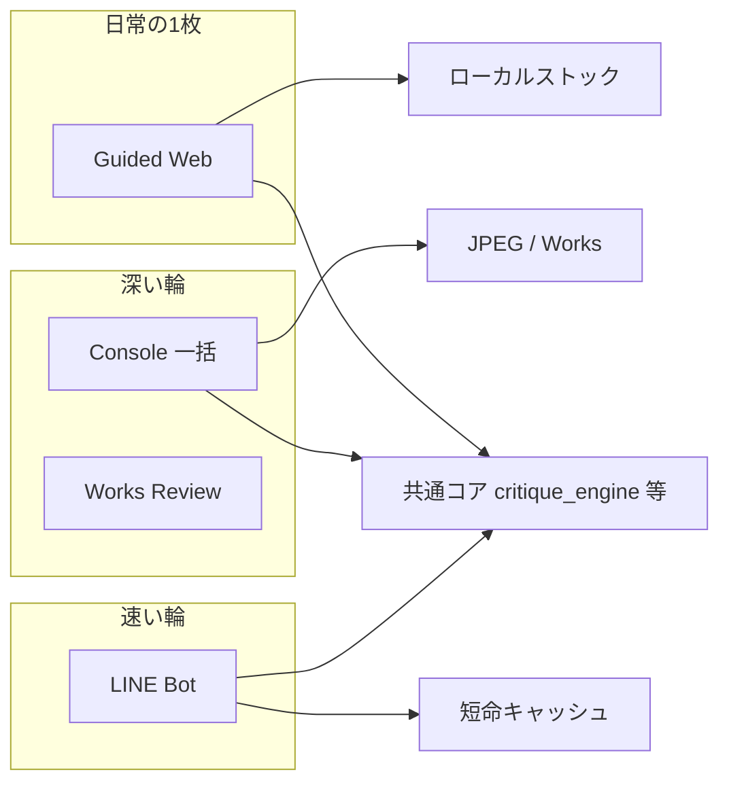
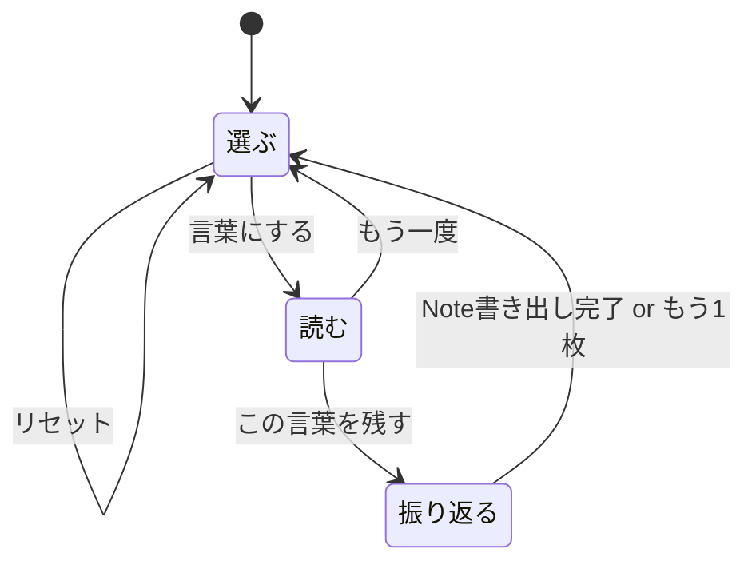

# P2-2 Phase 3 — Guided Web アプリ構想（N1）

更新日: 2026-08-28（改訂2）  
位置づけ: **実装前の合意正本**。オーナー PASS 後に FastAPI スパイク・MVP へ進む。  
根拠: オーナー指定の **3画面**（選ぶ・読む・振り返る）／添付 [`アプリ構想---.pdf`](../uploads/______---_b068.pdf) の UI 要素／既存合意（憲章・Phase 3）  
関連: [`P2_2_PUBLIC_UX_CHARTER.md`](P2_2_PUBLIC_UX_CHARTER.md) / [`CURRENT_APP_MAP.md`](CURRENT_APP_MAP.md) / [`P2_2_PHASE2_CARD.md`](P2_2_PHASE2_CARD.md)

---

## 0. 合意ステータス

| # | 項目 | 状態 |
|---|------|------|
| 1 | 3役割（Console / LINE / Web） | ✅ 合意済み |
| 2 | 1枚ずつ・ローカル Mac・`.command` 起動 | ✅ 合意済み |
| 3 | Console と同じ情報量・UI は段階開示 | ✅ 合意済み |
| 4 | 気に入った応答をローカルにストック | ✅ 合意済み |
| 5 | **3画面**（選ぶ・読む・振り返る） | ✅ **オーナー指定（正）** |
| 6 | 本ドキュメント（速度・プライバシー・レンズ） | ⏳ **オーナー確認待ち** |
| 7 | 実装（FastAPI / ブラウザ UI） | ❌ 本ドキュメント PASS 後 |

**改訂メモ（2026-08-28）:**  
- 画面は **3つ** が正。旧案の「4画面（言葉にする／残す）」は廃止。  
- PDF 内の画面遷移表記（例: 「この言葉を残す → 読む」）は**無視**し、本ドキュメントの遷移図を正とする。  
- Sakana 提案資料は誤送のため、本構想から除外。

---

## 1. 目的（一文）

> **写真を1枚選ぶと、写真との対話が自然に立ち上がる言葉を返し、気に入った言葉をカードと Note として Mac 上に残す。**

採点アプリではない。正解を決めない。  
Console の「フォルダ一括・深い輪」と LINE の「友達・速い輪」の**あいだ**に置く、オーナー自身の**日常の往復**用サーフェス。

---

## 2. 3つの表面（再確認）

| 表面 | 誰のため | 入力 | 出力の残り方 |
|------|----------|------|----------------|
| **Console** | オーナー（パワーユーザー） | 月フォルダ・イベント一括 | JPEG Description / Works ノート / ログ |
| **LINE** | 身近な友達 | 写真1枚（チャット） | カード＋【1〜3】（短命・反応 QR） |
| **Guided Web（本構想）** | オーナー（ブランドの顔） | **写真1枚**（D&D） | **ストック**：カード PNG ＋ Note（フォトブック／展示のたね） |



---

## 3. 画面構成（3画面・オーナー指定）

画面名は **選ぶ・読む・振り返る** の3つ。  
添付 PDF の UI 要素（一言・スタイル・プルダウン・カード・Note）は取り込むが、**独立画面としての「言葉にする」「残す」は設けない**。

### 画面一覧

| # | 画面名 | 役割 | 憲章の輪 |
|---|--------|------|----------|
| 1 | **選ぶ** | 写真受け取り＋送信準備（一言・スタイル・言葉にする） | Photograph → Put into words |
| 2 | **読む** | API 応答を読む・詳細を開く | Look again / 対話 |
| 3 | **振り返る** | カード調整・Note 書き出し・あとで見返す | 残す・見返す |

### 画面遷移（正本）



| 操作 | 遷移先 |
|------|--------|
| リセット | **選ぶ**（セッション破棄） |
| 言葉にする | **読む** |
| もう一度 | **選ぶ** |
| この言葉を残す | **振り返る** |
| Noteに書き出す | 保存後 **選ぶ** へ（または完了トーストのあと選ぶ） |

---

### 3.1 選ぶ

**1画面にまとめるもの**（PDF スライド1〜2 相当）:

| UI | 動作 |
|----|------|
| 写真エリア | ドラッグ＆ドロップ、または「写真を選ぶ」 |
| 受け付け形式 | JPEG / PNG / HEIC（既存 `scanner` / `ai_vision` と同系） |
| 一言添えるなら（任意） | ユーザー意図。Console の Description ユーザー文に相当 |
| **スタイルを選択** | 対話レンズ（`lens`）— §7 |
| 圧縮画像プレビュー | API 送信予定の見た目（透明性） |
| 抽出パラメータ表示 | 抽象化済みパラメータの要約 |
| **言葉にする** | API 呼び出し開始 → **読む**へ |
| **リセット** | 一時ファイル破棄。選ぶ画面を初期状態に |

写真確定後、ローカルで即時:

1. プレビュー用サムネイル生成  
2. `scanner.extract_file_metadata` でメタ抽出（**ローカルログ用にフル保持**）  
3. 圧縮プレビューと抽象パラメータを画面に表示  

**やらないこと:** フォルダ一括、Rating、M1〜M3

---

### 3.2 読む

**PDF スライド3 相当**（応答の読み取りに専念）:

| 段階 | 表示内容 | 開示 |
|------|----------|------|
| 待ち | API 応答待ちアニメーション（スケルトン UI） | 遷移直後から |
| 最初に見せる | TITLE / SUMMARY / CRITIQUE_SUMMARY（カード相当の言葉） | 常時 |
| プルダウン1 | **観察の輪郭**（`<Score>` — 表層は採点語を避ける） | 折りたたみ |
| プルダウン2 | **情景描写**（Phase2 【2】相当） | 折りたたみ |
| さらに開く | 【1】【3】【4】【5】【6】【7】を Accordion | Console Full と同内容 |
| **この言葉を残す** | **振り返る** へ | — |
| **もう一度** | **選ぶ** へ（セッション破棄） | — |

LINE は【1〜3】のみだが、**Web は Console と同じ Full 本文を保持**し、UI だけ薄くする。

**体感速度:** 「言葉にする」押下後 **0.2s 以内に読むへ遷移**し、Phase1 到着で言葉を先に表示（§6）。

---

### 3.3 振り返る

**PDF スライド4 相当**（残す・見返す・書き出す）:

| UI | 内容 |
|----|------|
| カードプレビュー | `generate_critique_card` 準拠（写真→言葉→★二次） |
| 一言表示 | 選ぶ画面で入力があればカード上に反映 |
| この写真に対する思い ★ | ユーザー主観の熱量 1〜5（**AI の ★5軸とは別**・任意） |
| カードの色 | 既存 `card_theme` のプリセット |
| 一言（再編集・任意） | 書き出し前に微修正可 |
| その他選択肢 | MVP 以降で拡張（チェックボックス枠のみでも可） |
| **Noteに書き出す** | ローカルストックへ保存 → **選ぶ** へ戻る |

画面名「振り返る」は、憲章の **見返す** と対応する。フォトブック・展示の「たね」として後から開き直す入口。

---

## 4. ユーザー体験の芯（憲章との接続）

| 憲章 | Web の3画面 |
|------|-------------|
| 残す・見返す・言葉にする・もう一度見る | 選ぶ（言葉にする）→ 読む（もう一度見る）→ 振り返る（残す・見返す） |
| UI は導きすぎない | プルダウン／Accordion で詳細は任意 |
| 採点・評価を主役にしない | ★は下・小さく。最初は言葉 |
| Navy / Ivory / Gold | ローカル Web の CSS トークンで再現 |

完了メッセージ例: 「言葉を残しました。あとで振り返れます。」

---

## 5. 技術シェル（ローカル・ハイブリッド）

憲章 §4 どおり。**クラウドをライブラリ正本にしない。**

```text
LuminaNotesGuided.command
  → ローカル FastAPI（127.0.0.1:固定ポート）
  → 既定ブラウザで http://127.0.0.1:.../ を開く
  → 静的 HTML/JS または軽量フレームワーク（スパイクで決定）
  → 既存 Python コアを import（critique_engine / scanner / card）
```

| 項目 | 方針 |
|------|------|
| データ正本 | Mac ローカルフォルダ（ストック用、§8） |
| 一時ファイル | セッション用 temp。リセット／完了で削除 |
| API キー | `~/.openai_api_key` 等、既存と同じ |
| オフライン | 不可（Vision API 必須）。エラー時は丁寧な次の一手 |

---

## 6. 体感速度の設計

**方針:** 実時間短縮と**知覚的短縮**の両方。

### 6.1 生成パイプライン（既存コア）

| 段階 | 内容 | ユーザーへの見せ方 |
|------|------|-------------------|
| **Phase1** | TITLE / SUMMARY / SCORES / CRITIQUE_SUMMARY | **読む画面で最優先表示** |
| **Phase2** | 【1〜7】長文 | バックグラウンド → Accordion を順次埋める |

### 6.2 知覚的短縮（UI）

1. **即遷移** — 「言葉にする」→ **読む**（API 完了を待たない）  
2. **スケルトン** — 写真枠・言葉プレースホルダ・アニメーション  
3. **段階的描画** — Phase1: TITLE → SUMMARY → CRITIQUE_SUMMARY  
4. **ローカル先行** — 選ぶ画面で圧縮プレビューとパラメータは表示済み  
5. **ストリーミング（将来）** — Phase2 本文の追記表示  

### 6.3 成功指標（Mac チェック用）

- 言葉にする → 読む画面: **&lt; 500ms**  
- Phase1 表示: 体感的に「すぐ言葉が始まった」  
- Phase2: 読める部分から読める（全文待ちを強制しない）

---

## 7. 分析タイプ（レンズ / スタイル）

表層ラベル **「スタイル」**、実装キー **`lens`**（`mode` と直交）。**選ぶ画面**で選択。

| lens ID | 表層名（案） | 状態 |
|---------|--------------|------|
| `self` | 自分の写真と対話 | **MVP** |
| `audience` | 見る人の目線 | 将来 |

MVP は `self` のみ。選択値はセッション JSON と Note に記録。

---

## 8. プライバシー設計（二重経路）

**原則:** Mac 上には**詳しく**残し、**外部 API には必要最小限**を送る。

### 8.1 ローカル（詳細）

| 保存先 | 内容 |
|--------|------|
| セッションログ | 元ファイル名、EXIF 全文、ユーザー一言、lens、API 応答全文、タイムスタンプ |
| ストック Note | `DesktopLogManager` 互換 Markdown |
| 監査 JSON | ペイロードハッシュ、モデル名（キー・生 GPS は含めない） |

### 8.2 API 送信（最小化）

| 送る | 送らない |
|------|----------|
| EXIF 除去済み圧縮 JPEG | オリジナルファイル、GPS、シリアル |
| 抽象化パラメータ（日時・絞り・ISO 等） | ローカルパス・ファイル名 |
| ユーザー一言（任意） | 個人特定可能な生メタの羅列 |
| プロンプト（lens 込み） | |

Vision 講評には画素が必要なため画像は送る。**EXIF は画像から除去**し、パラメータは抽象化して送る。

### 8.3 ストック（振り返る → Note）

```text
~/Pictures/LuminaNotes/Guided/
  YYYYMM/
    YYYYMMDD_HHMMSS_{stem}/
      photo.jpg
      card.png
      note.md
      session.json
```

---

## 9. 日本語応答品質

- 本番モデルは現行どおり **`gpt-4o-mini`**（`ai_vision.DEFAULT_OPENAI_MODEL`）。  
- 品質向上は **P2-1 プロンプト改善ループ**（`critique_prompts.py` / fixture）を継続。  
- **モデル切替は Web MVP のスコープ外**（別タイミングで検討。憲章 §8 参照）。

---

## 10. 既存コアの再利用

| 機能 | モジュール |
|------|------------|
| メタ抽出 | `scanner.py` + API 用抽象化（新規 thin wrapper） |
| 2段階講評 | `critique_engine.py`（`mode=full`） |
| パース | `critique_parser.py` |
| カード | `generate_critique_card.py` |
| テーマ色 | `card_theme.py` |
| 画像圧縮 | `ai_vision.prepare_vision_image_bytes` |
| Note 形式 | `log_manager.DesktopLogManager` |

**新規（最小）:** `guided_web/`、FastAPI、`guided_privacy.py`、3画面フロント、`LuminaNotesGuided.command`

---

## 11. MVP スコープ

### 含める

- **3画面**（選ぶ・読む・振り返る）  
- lens=`self`、Phase1 先行 + Phase2 全文  
- プライバシー二重経路、ローカルストック  
- Mac `.command` 起動  

### 含めない

- フォルダ一括、クラウド正本、LINE 連携、`audience` レンズ、モバイル最適化  
- モデル切替、Score/【1〜7】構造変更（別タスク）

---

## 12. 確認事項（質問）

| # | 質問 | 提案 |
|---|------|------|
| Q1 | ストック先 `~/Pictures/LuminaNotes/Guided/` でよいか | 上記 |
| Q2 | Note は DesktopLogManager 互換 md でよいか | はい |
| Q3 | ユーザー★は任意でよいか | 任意 |
| Q4 | Note 書き出し後は **選ぶ** に戻るでよいか | はい |
| Q5 | API は EXIF 除去画像 + 抽象パラメータでよいか | はい |

---

## 13. PASS / FAIL チェックリスト

| # | 確認項目 |
|---|----------|
| 1 | **3画面**（選ぶ→読む→振り返る）で日常1枚が回る |
| 2 | 選ぶ画面に一言・スタイル・言葉にするがまとまっている |
| 3 | Console 同量の本文をプルダウンで段階開示 |
| 4 | 振り返るでカード＋Note ストック |
| 5 | 体感速度（即読む遷移・Phase1 先行） |
| 6 | プライバシー（ローカル詳細 / API 最小） |
| 7 | lens（MVP は self） |
| 8 | 実装は本ドキュメント PASS 後 |

---

## 14. 実装順（PASS 後）

| Step | 内容 |
|------|------|
| 1 | FastAPI スパイク（1枚 → Phase1 JSON） |
| 2 | **3画面** UI + SSE/WebSocket |
| 3 | プライバシー層 + セッションログ |
| 4 | 振り返る + Note 書き出し |
| 5 | `.command` + Mac チェックリスト |

---

## 15. 変更履歴

| 日付 | 内容 |
|------|------|
| 2026-08-28 | 初版（4画面案） |
| 2026-08-28 | **改訂2:** 3画面（選ぶ・読む・振り返る）に確定。Sakana 除外。PDF 遷移表記は無視 |
